```r
library(tidyverse)
library(reshape2)
library(factoextra)
library(pheatmap)
library(circlize)
library(UpSetR)
library(data.table)
library(parallel)
library(survival)
library(survminer)
```


```r
EGA_CEMT = read.table("../data/table_EGA_CEMT.txt", head = T)
geneid = read.table("../data/hg38v79_genes", header = T)[,c(1,7)]
EGA_CEMT2 = left_join(geneid, EGA_CEMT,  by = c( "stable_id" = "ENSG")) %>% na.omit() %>% select(-stable_id)
EGA_CEMTm = melt(EGA_CEMT2)

mcll = c( "CLL.110", "CLL.1228",  "CLL.1525", "CLL.1532",  "CLL.3", "CLL_97", "CLL_93", "CLL_96", "CLL_94", "CLL_6", "CLL_28", "CLL_5", "CLL_26", "CLL_25",  "CLL_1")
ucll = c("CLL.12", "CLL.182", "CLL_92", "CLL_95", "CLL_30", "CLL_27", "CLL_29", "CLL_4")

EGA_CEMTm$Cell <- ifelse(EGA_CEMTm$variable %in% mcll, "mCLL", 
                  ifelse(EGA_CEMTm$variable %in% ucll, "uCLL",
                         ifelse(grepl("MBC", EGA_CEMTm$variable, ignore.case = T), "MBC", 
                                ifelse(grepl("HMPC", EGA_CEMTm$variable, ignore.case = T), "HMPC",
                                       ifelse(grepl("NBC", EGA_CEMTm$variable, ignore.case = T), "NBC",
                                              ifelse(grepl("PBC", EGA_CEMTm$variable, ignore.case = T), "PBC",
                                                     ifelse(grepl("PreBC", EGA_CEMTm$variable, ignore.case = T), "PreBC", # no rna-seq data
                                                            ifelse(grepl("GCBC", EGA_CEMTm$variable, ignore.case = T), "GCBC", 
                                                                   ifelse(grepl("CLP", EGA_CEMTm$variable, ignore.case = T), "CLP", "nothing")))))))))

EGA_CEMTm2 = EGA_CEMTm 
EGA_CEMTm2$Cell = factor(EGA_CEMTm2$Cell, levels = c("HMPC", "CLP", "NBC", "GCBC", "MBC", "PBC", "uCLL", "mCLL"))

EGA_CEMTm2 = EGA_CEMTm2 %>% filter(Cell != "HMPC") %>% 
  filter(Cell !=  "CLP")

gene_expression = function(geneName)
{
  plot = EGA_CEMTm2 %>% filter(display_label == geneName) %>%
    ggplot(aes(Cell, (value), fill = Cell)) +
    scale_fill_manual(values=c( "#636363", "#35B779FF", "#26828EFF", "#3E4A89FF", "#fa9fb5", "#c51b8a")) +
    geom_boxplot() +
    geom_jitter(width = .1) +
    theme_bw() +
    ylab("RPKM") +
    xlab(geneName) +
    theme(panel.background = element_rect(fill = "white"),
          panel.border = element_rect(fill = NA, colour = "gray", size = 1),
          strip.background =element_rect(fill="white"),
          panel.grid.major=element_line(colour="white"),
          panel.grid.minor=element_line(colour="white"),
          legend.position = "none",
          axis.text = element_text(color = "black", angle = 90, vjust = 0.5, hjust=1))
  
  print(plot)
}
```

### Figure 1.

#### 1C


```r
## PCA

#h3k27ac
nbc = read_tsv("../data/de_chipseq/H3K27ac.NBC.enriched_over4cell_0.75percent_matrix.tsv")
n1 = nrow(nbc)

gcbc = read_tsv("../data/de_chipseq/H3K27ac.GCBC.enriched_over4cell_0.75percent_matrix.tsv")
n2 = nrow(gcbc)

mbc = read_tsv("../data/de_chipseq/H3K27ac.MBC.enriched_over4cell_0.75percent_matrix.tsv")
n3 = nrow(mbc)

pbc = read_tsv("../data/de_chipseq/H3K27ac.PBC.enriched_over4cell_0.75percent_matrix.tsv")
n4 = nrow(pbc)

cll = read_tsv("../data/de_chipseq/H3K27ac.CLL.enriched_over4cell_0.75percent_matrix.tsv")
n5 = nrow(cll)

ucll = read_tsv("../data/de_chipseq/H3K27ac.mCLL_uCLL_unmutated_enriched_matirx.tsv")
names(ucll)[1]<-paste("A.intersect.value")
n6 = nrow(ucll)

mcll = read_tsv("../data/de_chipseq/H3K27ac.mCLL_uCLL_mutated_enriched_matirx.tsv")
names(mcll)[1]<-paste("A.intersect.value")
n7 = nrow(mcll)

x = rbind(nbc, gcbc, mbc, pbc, cll, ucll, mcll)

x = x %>% select(-contains("MACS2NoInput")) 

nbc = x %>% select(contains("NBC"))
gcb = x %>% select(contains("GCBC"))
mbc = x %>% select(contains("MBC"))
pbc = x %>% select(contains("PBC"))

u = c("CEMT_92", "CEMT_95", "CEMT_30", "CEMT_27", "CEMT_29", "CEMT_4", "EGAN00001202788", "EGAN00001202787")
m = c("CEMT_97", "CEMT_93", "CEMT_96", "CEMT_94", "CEMT_6", "CEMT_28", "CEMT_5", "CEMT_26", "CEMT_25",  "CEMT_1", "EGAN00001202789",  "EGAN00001265750", "EGAN00001295796", "EGAN00001235813", "EGAN00001202786")

ucll = x %>% select(contains(u)) 
mcll = x %>% select(contains(m)) %>% select(-contains("CEMT_129"), -contains("CEMT_13")) #rem gcb

x2 = cbind(nbc, gcb, mbc, pbc, ucll, mcll)

#pca
x3 = data.frame(t(x2))
res.pca <- prcomp(x3, scale = TRUE)

res.pca <- prcomp(x3)

pca = data.frame(res.pca$x)

u = colnames(ucll)


pca$Cells <- ifelse(rownames(pca) %in% u, "uCLL",
                    ifelse(grepl("MBC", rownames(pca), ignore.case = T), "MBC", 
                           ifelse(grepl("HMPC", rownames(pca), ignore.case = T), "HMPC",
                                  ifelse(grepl("NBC", rownames(pca), ignore.case = T), "NBC",
                                         ifelse(grepl("PBC", rownames(pca), ignore.case = T), "PBC",
                                                ifelse(grepl("PreBC", rownames(pca), ignore.case = T), "PreBC",
                                                       ifelse(grepl("GCBC", rownames(pca), ignore.case = T), "GCBC", "mCLL")))))))

pca$Cells = factor(pca$Cells, levels = c("NBC", "GCBC", "MBC",  "PBC", "uCLL", "mCLL"))

H3K27ac = ggplot(pca, aes(PC1, PC2, color = Cells)) +
  scale_color_manual(values=c("#636363", "#35B779FF", "#26828EFF", "#3E4A89FF", "#F59EB5", "#C61D8A")) +
  geom_point(size = 6.5, alpha = 1) +
  xlab("PC1 (49%)") +
  ylab("PC2 (14%)") +
  ggtitle("H3K27ac") +
  theme(panel.background = element_rect(fill = "white"),
        panel.border = element_rect(fill = NA, colour = "gray", size = 1),
        strip.background =element_rect(fill="white"),
        axis.text=element_blank(),
        legend.position = "none")

#H3K27me3
nbc = read_tsv("../data/de_chipseq/H3K27me3.NBC.enriched_over4cell_0.75percent_matrix.tsv")
n1 = nrow(nbc)

gcbc = read_tsv("../data/de_chipseq/H3K27me3.GCBC.enriched_over4cell_0.75percent_matrix.tsv")
n2 = nrow(gcbc)

mbc = read_tsv("../data/de_chipseq/H3K27me3.MBC.enriched_over4cell_0.75percent_matrix.tsv")
n3 = nrow(mbc)

pbc = read_tsv("../data/de_chipseq/H3K27me3.PBC.enriched_over4cell_0.75percent_matrix.tsv")
n4 = nrow(pbc)

cll = read_tsv("../data/de_chipseq/H3K27me3.CLL.enriched_over4cell_0.75percent_matrix.tsv")
n5 = nrow(cll)

ucll = read_tsv("../data/de_chipseq/H3K27me3.mCLL_uCLL_unmutated_enriched_matirx.tsv")
names(ucll)[1]<-paste("A.intersect.value")
n6 = nrow(ucll)

mcll = read_tsv("../data/de_chipseq/H3K27me3.mCLL_uCLL_mutated_enriched_matirx.tsv")
names(mcll)[1]<-paste("A.intersect.value")
n7 = nrow(mcll)

x = rbind(nbc, gcbc, mbc, pbc, cll, ucll, mcll)

x = x %>% select(-contains("MACS2NoInput")) 

nbc = x %>% select(contains("NBC"))
gcb = x %>% select(contains("GCBC"))
mbc = x %>% select(contains("MBC"))
pbc = x %>% select(contains("PBC"))

u = c("CEMT_92", "CEMT_95", "CEMT_30", "CEMT_27", "CEMT_29", "CEMT_4", "EGAN00001202788", "EGAN00001202787")
m = c("CEMT_97", "CEMT_93", "CEMT_96", "CEMT_94", "CEMT_6", "CEMT_28", "CEMT_5", "CEMT_26", "CEMT_25",  "CEMT_1", "EGAN00001202789",  "EGAN00001265750", "EGAN00001295796", "EGAN00001235813", "EGAN00001202786")

ucll = x %>% select(contains(u)) 
mcll = x %>% select(contains(m)) %>% select(-contains("CEMT_129"), -contains("CEMT_13")) #rem gcb

x2 = cbind(nbc, gcb, mbc, pbc, ucll, mcll)

#pca
x3 = data.frame(t(x2))
res.pca <- prcomp(x3, scale = TRUE)

res.pca <- prcomp(x3)

pca = data.frame(res.pca$x)

u = colnames(ucll)


pca$Cells <- ifelse(rownames(pca) %in% u, "uCLL",
                    ifelse(grepl("MBC", rownames(pca), ignore.case = T), "MBC", 
                           ifelse(grepl("HMPC", rownames(pca), ignore.case = T), "HMPC",
                                  ifelse(grepl("NBC", rownames(pca), ignore.case = T), "NBC",
                                         ifelse(grepl("PBC", rownames(pca), ignore.case = T), "PBC",
                                                ifelse(grepl("PreBC", rownames(pca), ignore.case = T), "PreBC",
                                                       ifelse(grepl("GCBC", rownames(pca), ignore.case = T), "GCBC", "mCLL")))))))

pca$Cells = factor(pca$Cells, levels = c("NBC", "GCBC", "MBC",  "PBC", "uCLL", "mCLL"))

H3K27me3 = ggplot(pca, aes(PC1, PC2, color = Cells)) +
  scale_color_manual(values=c("#636363", "#35B779FF", "#26828EFF", "#3E4A89FF", "#F59EB5", "#C61D8A")) +
  geom_point(size = 6.5, alpha = 1) +
  xlab("PC1 (43%)") +
  ylab("PC2 (20%)") +
  ggtitle("H3K27me3") +
  theme(panel.background = element_rect(fill = "white"),
        panel.border = element_rect(fill = NA, colour = "gray", size = 1),
        strip.background =element_rect(fill="white"),
        axis.text=element_blank(),
        legend.position = "none")

#H3K36me3
nbc = read_tsv("../data/de_chipseq/H3K36me3.NBC.enriched_over4cell_0.75percent_matrix.tsv")
n1 = nrow(nbc)

gcbc = read_tsv("../data/de_chipseq/H3K36me3.GCBC.enriched_over4cell_0.75percent_matrix.tsv")
n2 = nrow(gcbc)

mbc = read_tsv("../data/de_chipseq/H3K36me3.MBC.enriched_over4cell_0.75percent_matrix.tsv")
n3 = nrow(mbc)

pbc = read_tsv("../data/de_chipseq/H3K36me3.PBC.enriched_over4cell_0.75percent_matrix.tsv")
n4 = nrow(pbc)

cll = read_tsv("../data/de_chipseq/H3K36me3.CLL.enriched_over4cell_0.75percent_matrix.tsv")
n5 = nrow(cll)

ucll = read_tsv("../data/de_chipseq/H3K36me3.mCLL_uCLL_unmutated_enriched_matirx.tsv")
names(ucll)[1]<-paste("A.intersect.value")
n6 = nrow(ucll)

mcll = read_tsv("../data/de_chipseq/H3K36me3.mCLL_uCLL_mutated_enriched_matirx.tsv")
names(mcll)[1]<-paste("A.intersect.value")
n7 = nrow(mcll)

x = rbind(nbc, gcbc, mbc, pbc, cll, ucll, mcll)

x = x %>% select(-contains("MACS2NoInput")) 

nbc = x %>% select(contains("NBC"))
gcb = x %>% select(contains("GCBC"))
mbc = x %>% select(contains("MBC"))
pbc = x %>% select(contains("PBC"))

u = c("CEMT_92", "CEMT_95", "CEMT_30", "CEMT_27", "CEMT_29", "CEMT_4", "EGAN00001202788", "EGAN00001202787")
m = c("CEMT_97", "CEMT_93", "CEMT_96", "CEMT_94", "CEMT_6", "CEMT_28", "CEMT_5", "CEMT_26", "CEMT_25",  "CEMT_1", "EGAN00001202789",  "EGAN00001265750", "EGAN00001295796", "EGAN00001235813", "EGAN00001202786")

ucll = x %>% select(contains(u)) 
mcll = x %>% select(contains(m)) %>% select(-contains("CEMT_129"), -contains("CEMT_13")) #rem gcb

x2 = cbind(nbc, gcb, mbc, pbc, ucll, mcll)

#pca
x3 = data.frame(t(x2))
res.pca <- prcomp(x3, scale = TRUE)

res.pca <- prcomp(x3)

pca = data.frame(res.pca$x)

u = colnames(ucll)


pca$Cells <- ifelse(rownames(pca) %in% u, "uCLL",
                    ifelse(grepl("MBC", rownames(pca), ignore.case = T), "MBC", 
                           ifelse(grepl("HMPC", rownames(pca), ignore.case = T), "HMPC",
                                  ifelse(grepl("NBC", rownames(pca), ignore.case = T), "NBC",
                                         ifelse(grepl("PBC", rownames(pca), ignore.case = T), "PBC",
                                                ifelse(grepl("PreBC", rownames(pca), ignore.case = T), "PreBC",
                                                       ifelse(grepl("GCBC", rownames(pca), ignore.case = T), "GCBC", "mCLL")))))))

pca$Cells = factor(pca$Cells, levels = c("NBC", "GCBC", "MBC",  "PBC", "uCLL", "mCLL"))

H3K36me3 = ggplot(pca, aes(PC1, PC2, color = Cells)) +
  scale_color_manual(values=c("#636363", "#35B779FF", "#26828EFF", "#3E4A89FF", "#F59EB5", "#C61D8A")) +
  geom_point(size = 6.5, alpha = 1) +
  xlab("PC1 (55%)") +
  ylab("PC2 (15%)") +
  ggtitle("H3K36me3") +
  theme(panel.background = element_rect(fill = "white"),
        panel.border = element_rect(fill = NA, colour = "gray", size = 1),
        strip.background =element_rect(fill="white"),
        axis.text=element_blank(),
        legend.position = "none")

#H3k4me1
nbc = read_tsv("../data/de_chipseq/H3K4me1.NBC.enriched_over4cell_0.75percent_matrix.tsv")
n1 = nrow(nbc)

gcbc = read_tsv("../data/de_chipseq/H3K4me1.GCBC.enriched_over4cell_0.75percent_matrix.tsv")
n2 = nrow(gcbc)

mbc = read_tsv("../data/de_chipseq/H3K4me1.MBC.enriched_over4cell_0.75percent_matrix.tsv")
n3 = nrow(mbc)

pbc = read_tsv("../data/de_chipseq/H3K4me1.PBC.enriched_over4cell_0.75percent_matrix.tsv")
n4 = nrow(pbc)

cll = read_tsv("../data/de_chipseq/H3K4me1.CLL.enriched_over4cell_0.75percent_matrix.tsv")
n5 = nrow(cll)

ucll = read_tsv("../data/de_chipseq/H3K4me1.mCLL_uCLL_unmutated_enriched_matirx.tsv")
names(ucll)[1]<-paste("A.intersect.value")
n6 = nrow(ucll)

mcll = read_tsv("../data/de_chipseq/H3K4me1.mCLL_uCLL_mutated_enriched_matirx.tsv")
names(mcll)[1]<-paste("A.intersect.value")
n7 = nrow(mcll)

x = rbind(nbc, gcbc, mbc, pbc, cll, ucll, mcll)

x = x %>% select(-contains("MACS2NoInput")) 

nbc = x %>% select(contains("NBC"))
gcb = x %>% select(contains("GCBC"))
mbc = x %>% select(contains("MBC"))
pbc = x %>% select(contains("PBC"))

u = c("CEMT_92", "CEMT_95", "CEMT_30", "CEMT_27", "CEMT_29", "CEMT_4", "EGAN00001202788", "EGAN00001202787")
m = c("CEMT_97", "CEMT_93", "CEMT_96", "CEMT_94", "CEMT_6", "CEMT_28", "CEMT_5", "CEMT_26", "CEMT_25",  "CEMT_1", "EGAN00001202789",  "EGAN00001265750", "EGAN00001295796", "EGAN00001235813", "EGAN00001202786")

ucll = x %>% select(contains(u)) 
mcll = x %>% select(contains(m)) %>% select(-contains("CEMT_129"), -contains("CEMT_13")) #rem gcb

x2 = cbind(nbc, gcb, mbc, pbc, ucll, mcll)

x3 = data.frame(t(x2))
res.pca <- prcomp(x3, scale = TRUE)

res.pca <- prcomp(x3)

pca = data.frame(res.pca$x)

u = colnames(ucll)


pca$Cells <- ifelse(rownames(pca) %in% u, "uCLL",
                    ifelse(grepl("MBC", rownames(pca), ignore.case = T), "MBC", 
                           ifelse(grepl("HMPC", rownames(pca), ignore.case = T), "HMPC",
                                  ifelse(grepl("NBC", rownames(pca), ignore.case = T), "NBC",
                                         ifelse(grepl("PBC", rownames(pca), ignore.case = T), "PBC",
                                                ifelse(grepl("PreBC", rownames(pca), ignore.case = T), "PreBC",
                                                       ifelse(grepl("GCBC", rownames(pca), ignore.case = T), "GCBC", "mCLL")))))))

pca$Cells = factor(pca$Cells, levels = c("NBC", "GCBC", "MBC",  "PBC", "uCLL", "mCLL"))

H3K4me1 = ggplot(pca, aes(PC1, PC2, color = Cells)) +
  scale_color_manual(values=c("#636363", "#35B779FF", "#26828EFF", "#3E4A89FF", "#F59EB5", "#C61D8A")) +
  geom_point(size = 6.5, alpha = 1) +
  xlab("PC1 (62%)") +
  ylab("PC2 (11%)") +
  ggtitle("H3K4me1") +
  theme(panel.background = element_rect(fill = "white"),
        panel.border = element_rect(fill = NA, colour = "gray", size = 1),
        strip.background =element_rect(fill="white"),
        axis.text=element_blank(),
        legend.position = "none")

#H3K4me3
nbc = read_tsv("../data/de_chipseq/H3K4me3.NBC.enriched_over4cell_0.75percent_matrix.tsv")
n1 = nrow(nbc)

gcbc = read_tsv("../data/de_chipseq/H3K4me3.GCBC.enriched_over4cell_0.75percent_matrix.tsv")
n2 = nrow(gcbc)

mbc = read_tsv("../data/de_chipseq/H3K4me3.MBC.enriched_over4cell_0.75percent_matrix.tsv")
n3 = nrow(mbc)

pbc = read_tsv("../data/de_chipseq/H3K4me3.PBC.enriched_over4cell_0.75percent_matrix.tsv")
n4 = nrow(pbc)

cll = read_tsv("../data/de_chipseq/H3K4me3.CLL.enriched_over4cell_0.75percent_matrix.tsv")
n5 = nrow(cll)

ucll = read_tsv("../data/de_chipseq/H3K4me3.mCLL_uCLL_unmutated_enriched_matirx.tsv")
names(ucll)[1]<-paste("A.intersect.value")
n6 = nrow(ucll)

mcll = read_tsv("../data/de_chipseq/H3K4me3.mCLL_uCLL_mutated_enriched_matirx.tsv")
names(mcll)[1]<-paste("A.intersect.value")
n7 = nrow(mcll)

x = rbind(nbc, gcbc, mbc, pbc, cll, ucll, mcll)

x = x %>% select(-contains("MACS2NoInput")) 

nbc = x %>% select(contains("NBC"))
gcb = x %>% select(contains("GCBC"))
mbc = x %>% select(contains("MBC"))
pbc = x %>% select(contains("PBC"))

u = c("CEMT_92", "CEMT_95", "CEMT_30", "CEMT_27", "CEMT_29", "CEMT_4", "EGAN00001202788", "EGAN00001202787")
m = c("CEMT_97", "CEMT_93", "CEMT_96", "CEMT_94", "CEMT_6", "CEMT_28", "CEMT_5", "CEMT_26", "CEMT_25",  "CEMT_1", "EGAN00001202789",  "EGAN00001265750", "EGAN00001295796", "EGAN00001235813", "EGAN00001202786")

ucll = x %>% select(contains(u)) 
mcll = x %>% select(contains(m)) %>% select(-contains("CEMT_129"), -contains("CEMT_13")) #rem gcb

x2 = cbind(nbc, gcb, mbc, pbc, ucll, mcll)

x3 = data.frame(t(x2))
res.pca <- prcomp(x3, scale = TRUE)

res.pca <- prcomp(x3)

pca = data.frame(res.pca$x)

u = colnames(ucll)


pca$Cells <- ifelse(rownames(pca) %in% u, "uCLL",
                    ifelse(grepl("MBC", rownames(pca), ignore.case = T), "MBC", 
                           ifelse(grepl("HMPC", rownames(pca), ignore.case = T), "HMPC",
                                  ifelse(grepl("NBC", rownames(pca), ignore.case = T), "NBC",
                                         ifelse(grepl("PBC", rownames(pca), ignore.case = T), "PBC",
                                                ifelse(grepl("PreBC", rownames(pca), ignore.case = T), "PreBC",
                                                       ifelse(grepl("GCBC", rownames(pca), ignore.case = T), "GCBC", "mCLL")))))))

pca$Cells = factor(pca$Cells, levels = c("NBC", "GCBC", "MBC",  "PBC", "uCLL", "mCLL"))

H3K4me3 = ggplot(pca, aes(PC1, PC2, color = Cells)) +
  scale_color_manual(values=c("#636363", "#35B779FF", "#26828EFF", "#3E4A89FF", "#F59EB5", "#C61D8A")) +
  geom_point(size = 6.5, alpha = 1) +
  xlab("PC1 (76%)") +
  ylab("PC2 (6%)") +
  ggtitle("H3K4me3") +
  theme(panel.background = element_rect(fill = "white"),
        panel.border = element_rect(fill = NA, colour = "gray", size = 1),
        strip.background =element_rect(fill="white"),
        axis.text=element_blank(),
        legend.position = "none")

#H3K9me3
nbc = read_tsv("../data/de_chipseq/H3K9me3.NBC.enriched_over4cell_0.75percent_matrix.tsv")
n1 = nrow(nbc)

gcbc = read_tsv("../data/de_chipseq/H3K9me3.GCBC.enriched_over4cell_0.75percent_matrix.tsv")
n2 = nrow(gcbc)

mbc = read_tsv("../data/de_chipseq/H3K9me3.MBC.enriched_over4cell_0.75percent_matrix.tsv")
n3 = nrow(mbc)

pbc = read_tsv("../data/de_chipseq/H3K9me3.PBC.enriched_over4cell_0.75percent_matrix.tsv")
n4 = nrow(pbc)

cll = read_tsv("../data/de_chipseq/H3K9me3.CLL.enriched_over4cell_0.75percent_matrix.tsv")
n5 = nrow(cll)

ucll = read_tsv("../data/de_chipseq/H3K9me3.mCLL_uCLL_unmutated_enriched_matirx.tsv")
names(ucll)[1]<-paste("A.intersect.value")
n6 = nrow(ucll)

mcll = read_tsv("../data/de_chipseq/H3K9me3.mCLL_uCLL_mutated_enriched_matirx.tsv")
names(mcll)[1]<-paste("A.intersect.value")
n7 = nrow(mcll)

x = rbind(nbc, gcbc, mbc, pbc, cll, ucll, mcll)

x = x %>% select(-contains("MACS2NoInput")) 

nbc = x %>% select(contains("NBC"))
gcb = x %>% select(contains("GCBC"))
mbc = x %>% select(contains("MBC"))
pbc = x %>% select(contains("PBC"))

u = c("CEMT_92", "CEMT_95", "CEMT_30", "CEMT_27", "CEMT_29", "CEMT_4", "EGAN00001202788", "EGAN00001202787")
m = c("CEMT_97", "CEMT_93", "CEMT_96", "CEMT_94", "CEMT_6", "CEMT_28", "CEMT_5", "CEMT_26", "CEMT_25",  "CEMT_1", "EGAN00001202789",  "EGAN00001265750", "EGAN00001295796", "EGAN00001235813", "EGAN00001202786")

ucll = x %>% select(contains(u)) 
mcll = x %>% select(contains(m)) %>% select(-contains("CEMT_129"), -contains("CEMT_13")) #rem gcb

x2 = cbind(nbc, gcb, mbc, pbc, ucll, mcll)

x3 = data.frame(t(x2))
res.pca <- prcomp(x3, scale = TRUE)

res.pca <- prcomp(x3)

pca = data.frame(res.pca$x)

u = colnames(ucll)


pca$Cells <- ifelse(rownames(pca) %in% u, "uCLL",
                    ifelse(grepl("MBC", rownames(pca), ignore.case = T), "MBC", 
                           ifelse(grepl("HMPC", rownames(pca), ignore.case = T), "HMPC",
                                  ifelse(grepl("NBC", rownames(pca), ignore.case = T), "NBC",
                                         ifelse(grepl("PBC", rownames(pca), ignore.case = T), "PBC",
                                                ifelse(grepl("PreBC", rownames(pca), ignore.case = T), "PreBC",
                                                       ifelse(grepl("GCBC", rownames(pca), ignore.case = T), "GCBC", "mCLL")))))))

pca$Cells = factor(pca$Cells, levels = c("NBC", "GCBC", "MBC",  "PBC", "uCLL", "mCLL"))

H3K9me3 = ggplot(pca, aes(PC1, PC2, color = Cells)) +
  scale_color_manual(values=c("#636363", "#35B779FF", "#26828EFF", "#3E4A89FF", "#F59EB5", "#C61D8A")) +
  geom_point( size = 6.5, alpha = 1) +
  xlab("PC1 (37%)") +
  ylab("PC2 (17%)") +
  ggtitle("H3K9me3") +
  theme(panel.background = element_rect(fill = "white"),
        panel.border = element_rect(fill = NA, colour = "gray", size = 1),
        strip.background =element_rect(fill="white"),
        axis.text=element_blank(),
        legend.position = "none")

#DNAme
library(parallel)
clust <- makeCluster(10)
library(data.table)

####################
# on server gphost03
# get DE CpGs

# #parallel
# library(parallel)
# #no_cores <- detectCores()
# clust <- makeCluster(16)
# 
# install.packages("tidyverse", dependencies = TRUE)
# library(tidyverse)
# install.packages("data.table", dependencies = TRUE)
# library(data.table)
# 
# x = fread("/projects/blueprint_CLL_dart2/analysis/bisulfiteSeq/CpG_combined/table_metValue_hg38_NA-to-0-3outliers.txt", nThread = 24)
# y = fread("/projects/blueprint_CLL_dart2/analysis/bisulfiteSeq/analysis/DE_meth/all_pair_wise_subtypes/all_de_cpg_celltypes.txt", nThread = 24, header = F)
# 
# p = merge(x, y, by.x = "A.ID", by.y  = "V1")
# write.table(p, "/projects/blueprint_CLL_dart2/analysis/bisulfiteSeq/CpG_combined/table_DE_metValue_hg38_NA-to-0-3outliers.txt", row.names = T, col.names = T, quote = F)
# stopCluster(clust)

#end server
#################### 

# load pca data
x = read.table("../data/PCA_DE.table_metValue_hg38_NA-to-0-3outliers.txt")

ucll = c("EGAN00001343492:CLL.12:12CLL.bed.combine.5mC.CpG.NA_id.methValue", 
         "EGAN00001343490:CLL.182:182CLL.bed.combine.5mC.CpG.NA_id.methValue", 
         "CLL_95.bed.combine.5mC.CpG.NA_id.methValue", 
         "CLL_30.bed.combine.5mC.CpG.NA_id.methValue", 
         "CLL_30.large.bed.combine.5mC.CpG.NA_id.methValue", 
         "CLL_30.small.bed.combine.5mC.CpG.NA_id.methValue", 
         "CLL_27.bed.combine.5mC.CpG.NA_id.methValue", 
         "CLL_29.bed.combine.5mC.CpG.NA_id.methValue", 
         "CLL_4.bed.combine.5mC.CpG.NA_id.methValue")

x$Cells <- ifelse(x$Cell %in% ucll, "uCLL",
                  ifelse(grepl("MBC", x$Cell, ignore.case = T), "MBC", 
                         ifelse(grepl("HMPC", x$Cell, ignore.case = T), "HMPC",
                                ifelse(grepl("NBC", x$Cell, ignore.case = T), "NBC",
                                       ifelse(grepl("PBC", x$Cell, ignore.case = T), "PBC",
                                              ifelse(grepl("PreBC", x$Cell, ignore.case = T), "PreBC",
                                                     ifelse(grepl("GCBC", x$Cell, ignore.case = T), "GCBC", "mCLL")))))))


x$Cells = factor(x$Cells, levels = c("HMPC", "PreBC", "NBC", "GCBC", "MBC", "PBC", "uCLL", "mCLL"))

DNAme = ggplot(x, aes(PC1, PC2, color = Cells)) +
  scale_color_manual(values=c("#f0f0f0", "#bdbdbd", "#636363", "#35B779FF", "#26828EFF", "#3E4A89FF", "#fa9fb5", "#c51b8a")) +
  geom_point(size = 6.5, alpha = 1) +
  xlab("PC1 (41%)") +
  ylab("PC2 (06%)") +
  ggtitle("WGBS") +
  theme(panel.background = element_rect(fill = "white"),
        panel.border = element_rect(fill = NA, colour = "gray", size = 1),
        strip.background =element_rect(fill="white"),
        axis.text=element_blank(),
        legend.position = "none")

#RNA
pcaData = read.table("../data/PCA_RNAseq_with_HMPC.tsv") #need to use this in final plot
pcaData$group = factor(pcaData$group, levels = c("HMPC", "NBC", "GCBC", "MBC", "PBC", "uCLL", "mCLL"))

RNA = ggplot(pcaData, aes(PC1, PC2, color = group)) +
  scale_color_manual(values=c("#f0f0f0", "#636363", "#35B779FF", "#26828EFF", "#3E4A89FF", "#fa9fb5", "#c51b8a")) +
  geom_point(size = 5.5, alpha = 1) +
  xlab("PC1 (41%)") +
  ylab("PC2 (20%)") +
  ggtitle("RNA-seq") +
  theme(panel.background = element_rect(fill = "white"),
        panel.border = element_rect(fill = NA, colour = "gray", size = 1),
        strip.background =element_rect(fill="white"),
        axis.text=element_blank(),
        legend.position = "none")

library(patchwork)

(H3K27ac + H3K27me3 + H3K36me3 + H3K4me1 + H3K4me3 + H3K9me3 + DNAme + RNA) + plot_layout(ncol = 4)
```

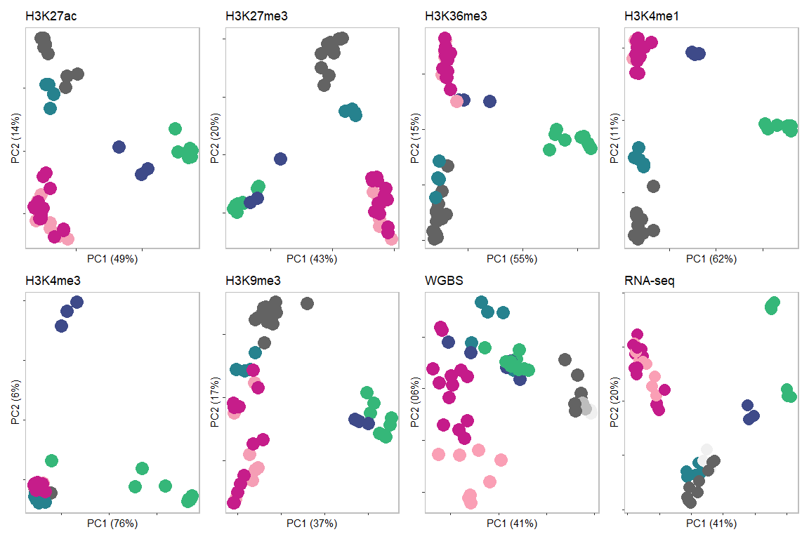<!-- -->

#### 1D


```r
nbc = read_tsv("../data/de_chipseq/H3K4me1.NBC.enriched_over4cell_0.75percent_matrix.tsv")
n1 = nrow(nbc)

gcbc = read_tsv("../data/de_chipseq/H3K4me1.GCBC.enriched_over4cell_0.75percent_matrix.tsv")
n2 = nrow(gcbc)

mbc = read_tsv("../data/de_chipseq/H3K4me1.MBC.enriched_over4cell_0.75percent_matrix.tsv")
n3 = nrow(mbc)

pbc = read_tsv("../data/de_chipseq/H3K4me1.PBC.enriched_over4cell_0.75percent_matrix.tsv")
n4 = nrow(pbc)

cll = read_tsv("../data/de_chipseq/H3K4me1.CLL.enriched_over4cell_0.75percent_matrix.tsv")
n5 = nrow(cll)

ucll = read_tsv("../data/de_chipseq/H3K4me1.mCLL_uCLL_unmutated_enriched_matirx.tsv")
names(ucll)[1]<-paste("A.intersect.value")
n6 = nrow(ucll)

mcll = read_tsv("../data/de_chipseq/H3K4me1.mCLL_uCLL_mutated_enriched_matirx.tsv")
names(mcll)[1]<-paste("A.intersect.value")
n7 = nrow(mcll)

x = rbind(nbc, gcbc, mbc, pbc, cll, ucll, mcll)

x = x %>% select(-contains("MACS2NoInput")) 

len <- x[,1] %>%
  separate(A.intersect.value, into = c("chr", "start", "end"), sep = "_") %>%
  mutate(Num1 = as.numeric(start), Num2 = as.numeric(end)) %>%
  mutate(Subtraction = Num2 - Num1) %>%
  select(Subtraction)

x = x %>% select(-A.intersect.value)
x = x/len$Subtraction

nbc = x %>% select(contains("NBC"))
gcb = x %>% select(contains("GCBC"))
mbc = x %>% select(contains("MBC"))
pbc = x %>% select(contains("PBC"))

u = c("CEMT_92", "CEMT_95", "CEMT_30", "CEMT_27", "CEMT_29", "CEMT_4", "EGAN00001202788", "EGAN00001202787")
m = c("CEMT_97", "CEMT_93", "CEMT_96", "CEMT_94", "CEMT_6", "CEMT_28", "CEMT_5", "CEMT_26", "CEMT_25",  "CEMT_1", "EGAN00001202789",  "EGAN00001265750", "EGAN00001295796", "EGAN00001235813", "EGAN00001202786")

ucll = x %>% select(contains(u))
mcll = x %>% select(contains(m)) %>% select(-contains("CEMT_129"), -contains("CEMT_13")) #rem gcb

x2 = cbind(nbc, gcb, mbc, pbc, ucll, mcll)

anno = data.frame("Cell" = c(rep("NBC",ncol(nbc)),rep("GCBC",ncol(gcb)),rep("MBC",ncol(mbc)),rep("PBC",ncol(pbc)),rep("uCLL",ncol(ucll)), rep("mCLL",ncol(mcll))))
rownames(anno) = colnames(x2)

my_colour = list(
  Cell = c(NBC = "#636363", GCBC = "#35B779FF", MBC = "#26828EFF", PBC = "#3E4A89FF", uCLL = "#F59EB5", mCLL = "#C61D8A"))

pheatmap(x2, 
         annotation_col = anno, 
         annotation_colors = my_colour,
         cluster_rows = F, 
         cluster_cols = F, 
         show_rownames = F, 
         show_colnames = F, 
         scale = "row", 
         border_color = NA,
         gaps_col = c(12, 12+9, 12+9+5, 12+9+5+3, 12+9+5+3+7, 12+9+5+3+7+12),
         gaps_row = c(n1, n1+n2, n1+n2+n3, n1+n2+n3+n4, n1+n2+n3+n4+n5, n1+n2+n3+n4+n5+n6, n1+n2+n3+n4+n5+n6+n7))
```

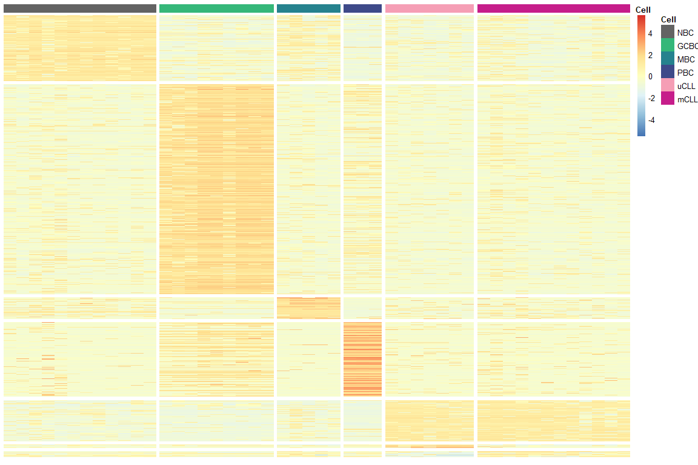<!-- -->

#### 1F


```r
gene_expression("LEF1")
```

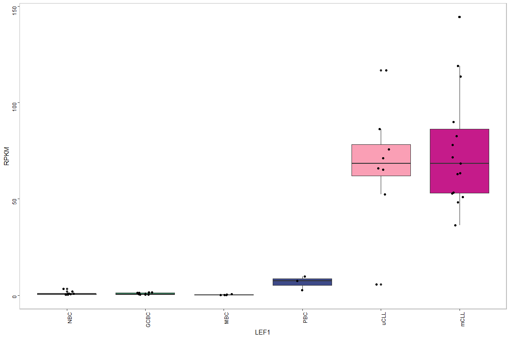<!-- -->

#### 1G


```r
e = read.table("../data/table_EGA_CEMT.txt", head = T)

#lef target
lef = read_tsv("../data/TSS5kb_cll_UPgenes.txt", col_names = F)

colnames(lef) = "ENSG"
e2 = left_join(lef, e) %>% select(starts_with("CLL")) %>% 
  melt() %>%
  mutate(Type = "lef-target")

#non-lef target
nlef = read.table("../data/Bcell_vs_CLL_DN.txt.genebody.pc")
nlef = data.frame(ENSG = unique(nlef$V7)) 
nlef = anti_join(nlef, lef)

e3 = left_join(nlef, e) %>% select(starts_with("CLL")) %>% 
  melt() %>%
  mutate(Type = "non-lef")

rbind(e2, e3) %>%
  ggplot(aes(Type, log10(value+0.001))) +
  geom_boxplot(outlier.shape = NA)  +
  theme(panel.background = element_rect(fill = "white"),
        panel.border = element_rect(fill = NA, colour = "gray", size = 1),
        strip.background =element_rect(fill="white"),
        axis.text = element_text(color = "black"),
        legend.position = "bottom")
```

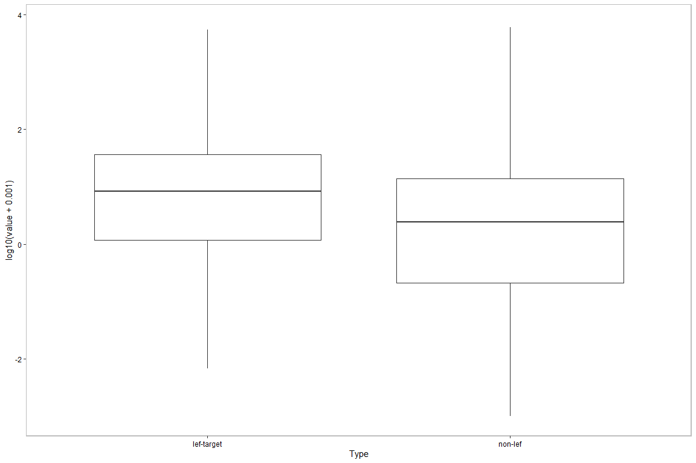<!-- -->

### Figure 2.

#### 2A


```r
x = read_tsv("../data/de_chipseq/H3K27ac.CLL.enriched_over4cell_0.75percent_matrix.tsv")
len = read.table("../data/de_chipseq/H3K27ac.CLL.enriched_over4cell_0.75percent_len.txt")

x = x %>% select(-contains("MACS2NoInput")) 

nbc = x %>% select(contains("NBC"))
n1=ncol(nbc)
gcb = x %>% select(contains("GCBC"))
n2=ncol(gcb)
mbc = x %>% select(contains("MBC"))
n3=ncol(mbc)
pbc = x %>% select(contains("PBC"))
n4=ncol(pbc)
cll = x %>% select(contains("CLL"))
n5=ncol(cll)

x2 = cbind(nbc, gcb, mbc, pbc, cll)

anno = data.frame("Cell" = c(rep("NBC",ncol(nbc)),rep("GCBC",ncol(gcb)),rep("MBC",ncol(mbc)),rep("PBC",ncol(pbc)), rep("CLL",ncol(cll))))
rownames(anno) = colnames(x2)

my_colour = list(
  Cell = c(NBC = "#636363", GCBC = "#35B779FF", MBC = "#26828EFF", PBC = "#3E4A89FF", CLL = "#C61D8A"))

x3 = x2/len$V2

pheatmap(x3, 
         color = colorRampPalette(c("#ece2f0", "#a6bddb", "#1c9099"))(100),
         annotation_col = anno, 
         annotation_colors = my_colour, 
         cluster_rows = T, 
         cluster_cols = F, 
         show_rownames = F, 
         show_colnames = F, 
         gaps_col = c(n1, n1+n2, n1+n2+n3, n1+n2+n3+n4, n1+n2+n3+n4+n5))
```

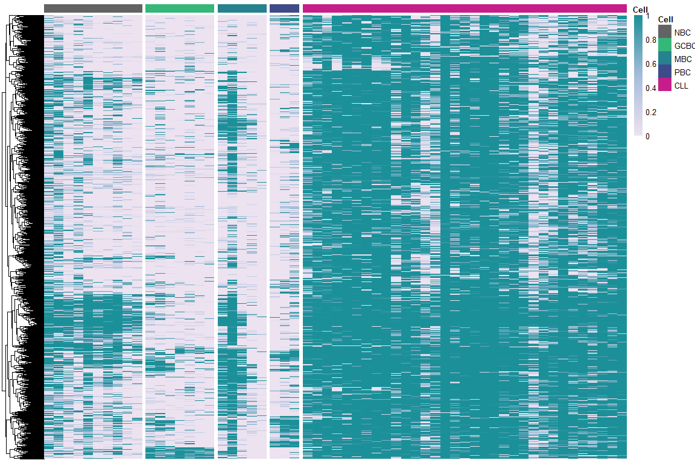<!-- -->

#### 2B


```r
# H3k4me1 heatmap
x = read_tsv("../data/de_chipseq/H3K4me1_enriched_at_H3K27ac_CLL_enriched_over_others.matrix.tsv")
len = read.table("../data/de_chipseq/H3K27ac.CLL.enriched_over4cell_0.75percent_len.txt")

x = x %>% select(-contains("MACS2NoInput")) 

nbc = x %>% select(contains("NBC"))
n1=ncol(nbc)
gcb = x %>% select(contains("GCBC")) %>% select(-contains("CEMT_135"))
n2=ncol(gcb)
mbc = x %>% select(contains("MBC")) %>% select(-contains("EGAN00001277490"))
n3=ncol(mbc)
pbc = x %>% select(contains("PBC"))
n4=ncol(pbc)

#
u = c("CEMT_92", "CEMT_95", "CEMT_30", "CEMT_27", "CEMT_29", "CEMT_4", "EGAN00001202788", "EGAN00001202787")
m = c("CEMT_97", "CEMT_93", "CEMT_96", "CEMT_94", "CEMT_6", "CEMT_28", "CEMT_5", "CEMT_26", "CEMT_25",  "CEMT_1", "EGAN00001202789",  "EGAN00001265750", "EGAN00001295796", "EGAN00001235813", "EGAN00001202786")

ucll = x %>% select(contains(u)) 
n5=ncol(ucll)

mcll = x %>% select(contains(m)) %>% select(-contains("CEMT_129"), -contains("CEMT_13")) #rem gcb
n6=ncol(mcll)

x2 = cbind(nbc, gcb, mbc, pbc, ucll, mcll)
row.names(x2) = x$A.intersect.value

anno = data.frame("Cell" = c(rep("NBC",ncol(nbc)),
                             rep("GCBC",ncol(gcb)),
                             rep("MBC",ncol(mbc)),
                             rep("PBC",ncol(pbc)), 
                             rep("uCLL",ncol(ucll)), 
                             rep("mCLL",ncol(mcll))))

rownames(anno) = colnames(x2)

my_colour = list(
  Cell = c(NBC = "#636363", GCBC = "#35B779FF", MBC = "#26828EFF", PBC = "#3E4A89FF", uCLL = "#F59EB5", mCLL = "#C61D8A"))

x3 = x2/len$V2

ph =pheatmap(x3, 
         color = colorRampPalette(c("#ece2f0", "#a6bddb", "#1c9099"))(100),
         annotation_col = anno, 
         annotation_colors = my_colour, 
         cluster_rows = T, 
         cluster_cols = F, 
         show_rownames = F, 
         show_colnames = F, 
         cutree_rows = 5,
         clustering_method = "ward.D2",
         gaps_col = c(n1, n1+n2, n1+n2+n3, n1+n2+n3+n4))
```

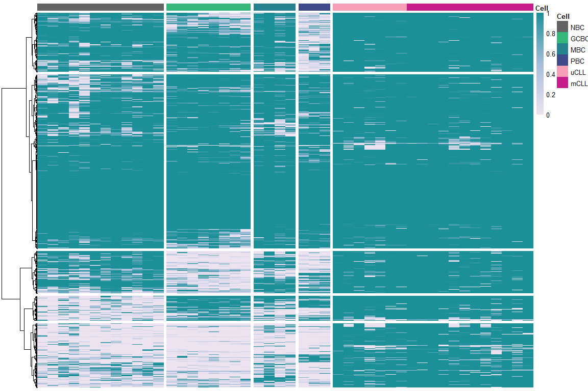<!-- -->

```r
# 5 cluster generated in the heatmap above 
t = data.frame(sort(cutree(ph$tree_row, k=5)))
t2 = data.frame(id = row.names(t), cluster = t$sort.cutree.ph.tree_row..k...5..)

t2 %>%
  group_by(cluster) %>%
  summarise(n = n())
```

```
## # A tibble: 5 × 2
##   cluster     n
##     <int> <int>
## 1       1   481
## 2       2  1305
## 3       3   444
## 4       4   316
## 5       5   184
```

```r
#### DNAme
me = read_tsv("../data/H3K27ac_CLL_enriched_over_others_dname.tsv")
me2 = me %>% 
  select(-starts_with("EGAN00001235812")) %>%
  select(-starts_with("EGAN00001286337")) %>%
  select(-starts_with("CLL_29")) %>%
  select(-contains("small")) %>% 
  select(-contains("large"))

# enh DNAme
df = merge(me2, t2, by.x = 'A.dname', by.y = "id") %>% 
  select(-A.dname)
colnames(df) <- gsub('.bed.combine.5mC.CpG.dname', '', colnames(df))

xm = melt(df, id.vars = "cluster") %>% na.omit()

ucll = c("EGAN00001343492:CLL.12:12CLL", "EGAN00001343490:CLL.182:182CLL", "CLL_95", "CLL_30", "CLL_30.large", "CLL_30.small", "CLL_27", "CLL_29", "CLL_4")
mcll = c( "EGAN00001343494:CLL.110:110CLL", "EGAN00001358479:CLL.1525:1525CLL", "EGAN00001358480:CLL.1532:1532CLL", "EGAN00001401801:CLL.1228:1228CLL",  "CLL.3", "CLL_97", "CLL_93", "CLL_96", "CLL_94", "CLL_6", "CLL_28", "CLL_5", "CLL_26", "CLL_25",  "CLL_1")

xm$Cell <- ifelse(xm$variable %in% mcll, "mCLL", 
                  ifelse(xm$variable %in% ucll, "uCLL",
                         ifelse(grepl("MBC", xm$variable, ignore.case = T), "MBC", 
                                ifelse(grepl("HMPC", xm$variable, ignore.case = T), "HMPC",
                                       ifelse(grepl("NBC", xm$variable, ignore.case = T), "NBC",
                                              ifelse(grepl("PBC", xm$variable, ignore.case = T), "PBC",
                                                     ifelse(grepl("PreBC", xm$variable, ignore.case = T), "PreBC", # no rna-seq data
                                                            ifelse(grepl("GCBC", xm$variable, ignore.case = T), "GCBC", 
                                                                   ifelse(grepl("CLP", xm$variable, ignore.case = T), "CLP", "nothing")))))))))

xm2 = xm %>%
  filter(Cell != "HMPC") %>%
  filter(Cell != "PreBC")

xm2$cluster <- factor(xm2$cluster, levels = c(3, 2, 4, 5, 1))
xm2$Cell <- factor(xm2$Cell, levels = c("NBC", "GCBC", "MBC", "PBC", "uCLL", "mCLL"))

xm2 %>%
  ggplot(aes(Cell, value)) +
  geom_hline(yintercept = 0.5, color = "gray", linetype = "dashed") +
  geom_violin(aes(fill = Cell)) +
  geom_boxplot(width = 0.05, fill = "white", color = "black", outlier.shape = NA, lwd = .1) +
  scale_fill_manual(values=c("#636363", "#35B779FF", "#26828EFF", "#3E4A89FF", "#fa9fb5", "#c51b8a")) +
  facet_grid(rows = vars(cluster)) +
  ylab("Average DNAme") +
  xlab("") +
  theme(panel.background = element_rect(fill = "white"),
        panel.border = element_rect(fill = NA, colour = "gray", size = 1),
        strip.background =element_rect(fill="white"),
        legend.position = "none",
        axis.text = element_text(color = "black", angle = 90, vjust = 0.5, hjust=1)) +
  scale_y_continuous(name = NULL, sec.axis = sec_axis(~., name = "Average DNAme")) +
  guides(y = "none")
```

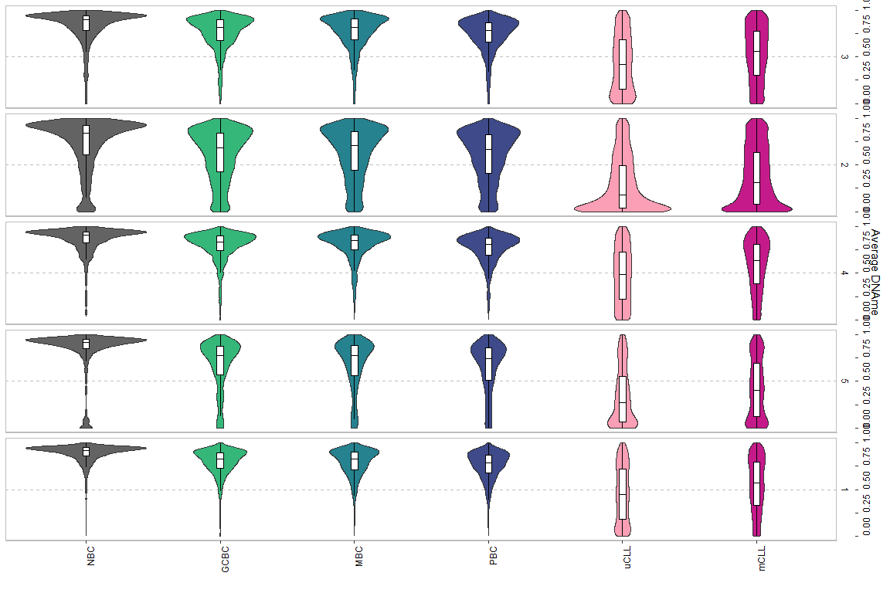<!-- -->

#### 2C


```r
# SE H3K27ac 134 genes
x = read.table("../data/de_chipseq/greatExportAll_H3K27ac_CLL_geneslist.txt")
dn = read.table("../data/Bcell_vs_CLL_DN.txt.genebody.pc")
x2 = data.frame(display_label = intersect(x$V1, dn$V5))

#### rpkm
k = read.table("../data/table_EGA_CEMT.txt", head = T)
gene = read.table("../data/hg38v79_genes", header = T)[,c(1,7)]
k2 = left_join(gene, k,  by = c( "stable_id" = "ENSG")) %>% na.omit() %>% select(-stable_id)

k_temp = left_join(x2, k2)

k3 = left_join(x2, k2) %>% 
  select(-display_label) %>% 
  select(-contains("CLP")) %>% 
  select(-contains("HMPC")) 

mcll = c( "CLL.110", "CLL.1228",  "CLL.1525", "CLL.1532",  "CLL.3", "CLL_97", "CLL_93", "CLL_96", "CLL_94", "CLL_6", "CLL_28", "CLL_5", "CLL_26", "CLL_25",  "CLL_1")
ucll = c("CLL.12", "CLL.182", "CLL_92", "CLL_95", "CLL_30", "CLL_27", "CLL_29", "CLL_4")

x = k3
nbc = x %>% select(contains("NBC"))
n1 = ncol(nbc)
gcb = x %>% select(contains("GCBC"))
n2 = ncol(gcb)
mbc = x %>% select(contains("MBC"))
n3 = ncol(mbc)
pbc = x %>% select(contains("PBC"))
n4 = ncol(pbc)
u_cll = x %>% select(any_of(ucll))
n5 = ncol(u_cll)
m_cll = x %>% select(any_of(mcll))
n6 = ncol(m_cll)

x2 = cbind(nbc, gcb, mbc, pbc, u_cll, m_cll)
rownames(x2) = k_temp$display_label

anno = data.frame("Cell" = c(rep("NBC",ncol(nbc)),
                             rep("GCBC",ncol(gcb)),
                             rep("MBC",ncol(mbc)),
                             rep("PBC",ncol(pbc)),
                             rep("uCLL",ncol(u_cll)),
                             rep("mCLL",ncol(m_cll))))

rownames(anno) = colnames(x2)

my_colour = list(
  Cell = c(NBC = "#636363", GCBC = "#35B779FF", MBC = "#26828EFF", PBC = "#3E4A89FF", uCLL = "#F59EB5", mCLL = "#C61D8A"))

pheatmap(log(x2+0.001), 
         ccolor = colorRampPalette(c("blue", "white", "red"))(100),
         annotation_col = anno,
         annotation_colors = my_colour, 
         cluster_rows = T, 
         cluster_cols = F, 
         show_rownames = T, 
         show_colnames = F, 
         scale = "row", 
         border_color = NA,
         gaps_col = c(n1, n1+n2, n1+n2+n3, n1+n2+n3+n4))
```

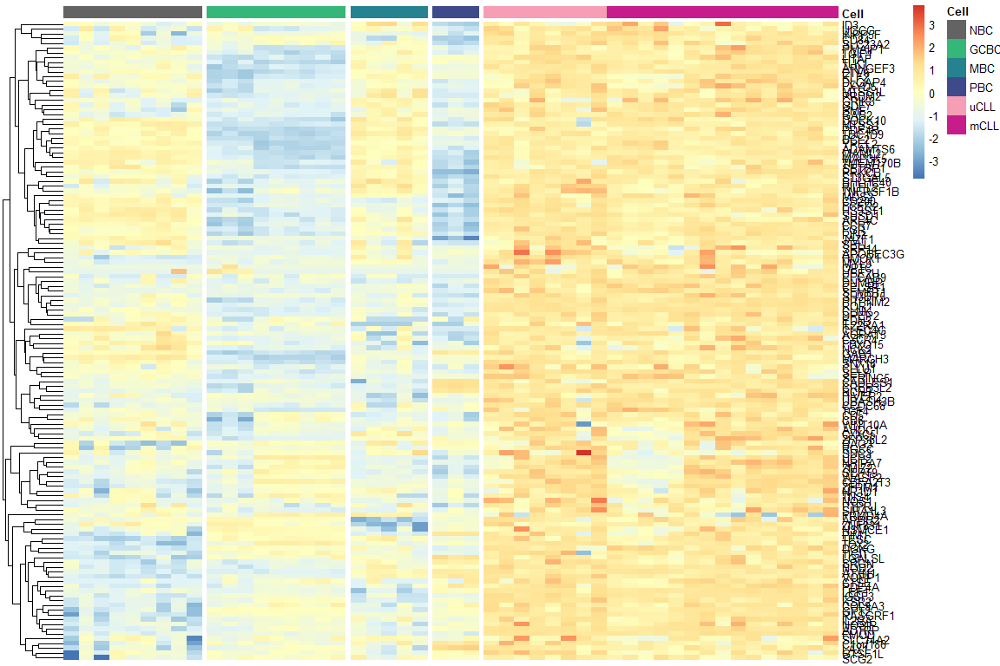<!-- -->

#### 2E


```r
me = read_tsv("../data/H3K27ac_CLL_enriched_over_others_dname.tsv")
me2 = me %>% 
  select(-starts_with("EGAN00001235812")) %>%
  select(-starts_with("EGAN00001286337")) %>%
  select(-starts_with("CLL_29")) %>%
  select(-contains("small")) %>% 
  select(-contains("large"))

bcl = read.table("../data/bcl2_34cll_specific_h3k27ac.txt")
colnames(bcl) = "A.dname"
df = inner_join(bcl, me2)
colnames(df) <- gsub('.bed.combine.5mC.CpG.dname', '', colnames(df))

xm = melt(df, id.vars = "A.dname") %>% na.omit()

ucll = c("EGAN00001343492:CLL.12:12CLL", "EGAN00001343490:CLL.182:182CLL", "CLL_95", "CLL_30", "CLL_30.large", "CLL_30.small", "CLL_27", "CLL_29", "CLL_4")
mcll = c( "EGAN00001343494:CLL.110:110CLL", "EGAN00001358479:CLL.1525:1525CLL", "EGAN00001358480:CLL.1532:1532CLL", "EGAN00001401801:CLL.1228:1228CLL",  "CLL.3", "CLL_97", "CLL_93", "CLL_96", "CLL_94", "CLL_6", "CLL_28", "CLL_5", "CLL_26", "CLL_25",  "CLL_1")

xm$Cell <- ifelse(xm$variable %in% mcll, "mCLL", 
                  ifelse(xm$variable %in% ucll, "uCLL",
                         ifelse(grepl("MBC", xm$variable, ignore.case = T), "MBC", 
                                ifelse(grepl("HMPC", xm$variable, ignore.case = T), "HMPC",
                                       ifelse(grepl("NBC", xm$variable, ignore.case = T), "NBC",
                                              ifelse(grepl("PBC", xm$variable, ignore.case = T), "PBC",
                                                     ifelse(grepl("PreBC", xm$variable, ignore.case = T), "PreBC", # no rna-seq data
                                                            ifelse(grepl("GCBC", xm$variable, ignore.case = T), "GCBC", 
                                                                   ifelse(grepl("CLP", xm$variable, ignore.case = T), "CLP", "nothing")))))))))

xm2 = xm %>%
  filter(Cell != "HMPC") %>%
  filter(Cell != "PreBC")

xm2$Cell <- factor(xm2$Cell, levels = c("NBC", "GCBC", "MBC", "PBC", "uCLL", "mCLL"))

xm2 %>%
  ggplot(aes(Cell, value)) +
  geom_hline(yintercept = 0.5, color = "gray", linetype = "dashed") +
  geom_violin(aes(fill = Cell)) +
  geom_boxplot(width = 0.05, fill = "white", color = "black", outlier.shape = NA, lwd = .1) +
  scale_fill_manual(values=c("#636363", "#35B779FF", "#26828EFF", "#3E4A89FF", "#fa9fb5", "#c51b8a")) +
  ylab("Average DNAme") +
  xlab("") +
  theme(panel.background = element_rect(fill = "white"),
        panel.border = element_rect(fill = NA, colour = "gray", size = 1),
        strip.background =element_rect(fill="white"),
        legend.position = "none",
        axis.text = element_text(color = "black", angle = 90, vjust = 0.5, hjust=1)) +
  scale_y_continuous(name = NULL, sec.axis = sec_axis(~., name = "Average DNAme")) +
  guides(y = "none")
```

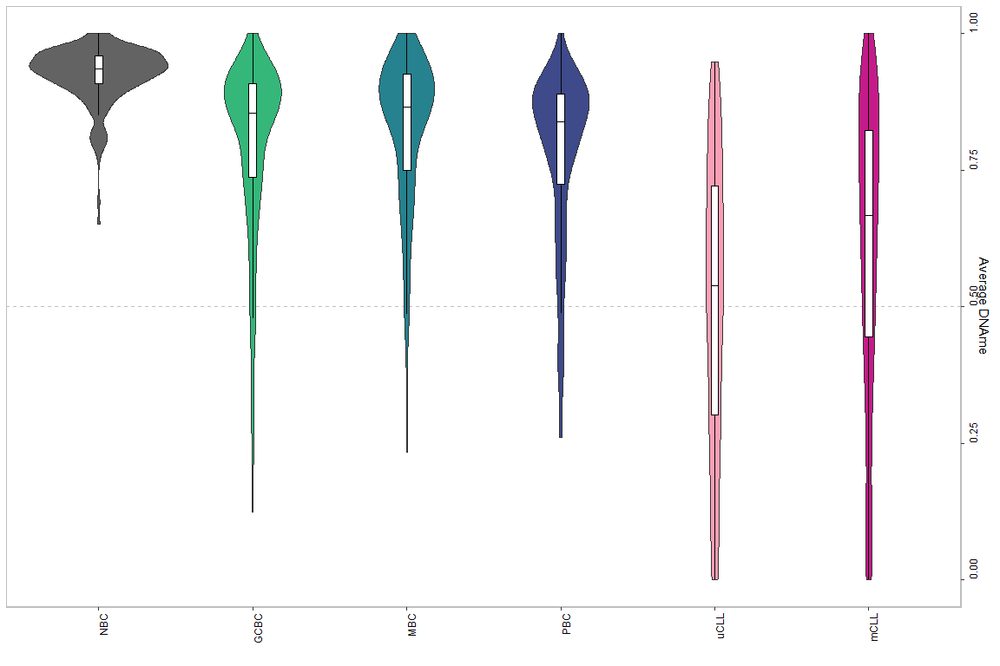<!-- -->

#### 1F


```r
gene_expression("BCL2")
```

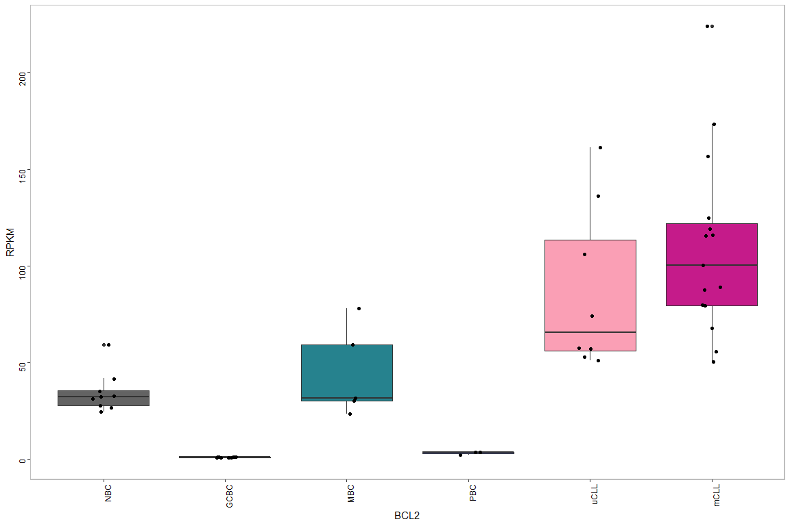<!-- -->

### Figure 3.

#### 3A


```r
x = read.table("../data/AvgMeth_H3K27ac_CLL_enriched_over4cell_0.75percent.txt")
x = x %>%
  filter(!grepl("shuffle", V2)) %>% 
  select(-V2) %>%
  mutate(type = "Enh_met")
colnames(x) = c("id", "met", "type")

y = read.table("../data/avgMetGenomeWide_53samples_v2.txt")
y = y %>%
  mutate(type = "global")
colnames(y) = c("id", "met", "type")
y$id <- gsub('.bed', '', y$id)

df = rbind(x,y)

df = df %>% 
  filter(!grepl("EGAN00001286337", id)) %>% 
  filter(!grepl("CLL_29", id)) 

df$id <- gsub('.bed.combine.5mC.CpG', '', df$id)
df$id <- gsub('.combine.5mC.CpG', '', df$id)

ucll = c("EGAN00001343492:CLL.12:12CLL", "EGAN00001343490:CLL.182:182CLL", "CLL_95", "CLL_30",  "CLL_27", "CLL_29", "CLL_4")

df$Cell <- ifelse(df$id %in% ucll, "uCLL",
                  ifelse(grepl("GCBC", df$id, ignore.case = T), "GCBC", 
                         ifelse(grepl("csMBC", df$id, ignore.case = T), "MBC", 
                                ifelse(grepl("HMPC", df$id, ignore.case = T), "HMPC",
                                       ifelse(grepl("NBC", df$id, ignore.case = T), "NBC",
                                              ifelse(grepl("PBC", df$id, ignore.case = T), "PBC",
                                                     ifelse(grepl("PreBC", df$id, ignore.case = T), "PreBC",
                                                            ifelse(grepl("MBC", df$id, ignore.case = T), "MBC", "mCLL"))))))))

df$Cell = factor(df$Cell, levels = c("HMPC","PreBC" , "NBC", "GCBC", "MBC", "PBC", "uCLL", "mCLL"))

df %>%
  ggplot(aes(Cell, met)) +
  geom_dotplot(aes(fill = type, color = NA), binaxis = "y", stackdir = "center", stackratio = .5, position = "dodge", dotsize = .5, alpha = .7) +
  geom_boxplot(aes(color = type), alpha = .1) +
  scale_color_manual(values = c("#c51b8a", "black")) +
  scale_fill_manual(values = c("#c51b8a", "black")) +
  xlab("") +
  ylab("Average methylation") +
  theme_bw() +
  theme(panel.background = element_rect(fill = "white"),
        panel.border = element_rect(fill = NA, colour = "gray", size = 1),
        strip.background =element_rect(fill="white"),
        axis.text = element_text(color = "black"),
        legend.position = "bottom")
```

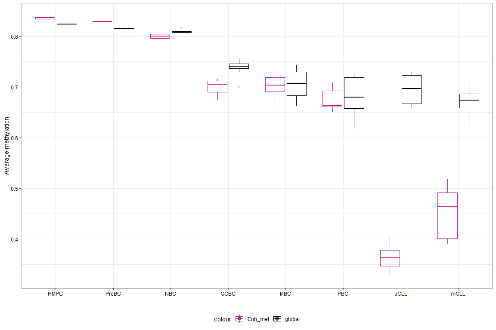<!-- -->

#### 3B


```r
xy = read_tsv("../data/cpg_CLL_enh.DNAMe.txt")

ucll = c("EGAN00001343492:CLL.12:12CLL", "EGAN00001343490:CLL.182:182CLL", "CLL_95", "CLL_30", "CLL_30.large", "CLL_30.small", "CLL_27", "CLL_29", "CLL_4")
mcll = c( "CLL.110", "CLL.1228",  "CLL.1525", "CLL.1532",  "CLL.3", "CLL_97", "CLL_93", "CLL_96", "CLL_94", "CLL_6", "CLL_28", "CLL_5", "CLL_26", "CLL_25",  "CLL_1")
low = c("PreBC", "NBC", "HMPC")
high = c("GCBC", "MBC", "PBC")

uCLL = xy %>% select(contains(ucll)) %>% mutate(mean = rowMeans(.))
mCLL = xy %>% select(contains(mcll)) %>% mutate(mean = rowMeans(.))
Low = xy %>% select(contains(low)) %>% mutate(mean = rowMeans(.))
High = xy %>% select(contains(high)) %>% mutate(mean = rowMeans(.))

#fc
df = data.frame(A.ID = xy$A.ID, lh = log2(Low$mean / (High$mean+0.001)), um = log2(uCLL$mean / (mCLL$mean+0.001))) 
df$type <- with(df, ifelse(um <= -1, 'Win',
                           ifelse(um >=1, 'Loss', 'Stable')))
temp = df %>% filter(type == "Win") %>% select(A.ID)

ggplot(df) +
  geom_point(aes(lh, um, color = type, size=1, shape=".")) +
  geom_point(data = subset(df, type == 'enh'),
             aes(lh, um, color = type, size=1, shape=".")) +
  scale_shape_manual(values=c(".")) +
  scale_color_manual(values = c( 'blue' ,'#c6c6c6', '#c51b8a')) + # was 'c('red', '#bdbdbd')'
  xlim(-6, 6) +
  ylim(-6, 6) +
  xlab("log2(PreGC/postGC)") +
  ylab("log2(uCLL/mCLL)") + 
  geom_hline(yintercept = c(0), color = "black") +
  geom_vline(xintercept = c(0), color = "black") +
  geom_hline(yintercept = c(-1,1), color = "gray") +
  geom_vline(xintercept = c(-1,1), color = "gray") +
  theme(panel.background = element_rect(fill = "white"),
        panel.border = element_rect(fill = NA, colour = "gray", size = 1),
        strip.background =element_rect(fill="white"),
        axis.text = element_text(color = "black"),
        legend.position = "none") +
  theme(text = element_text(size = 24))
```

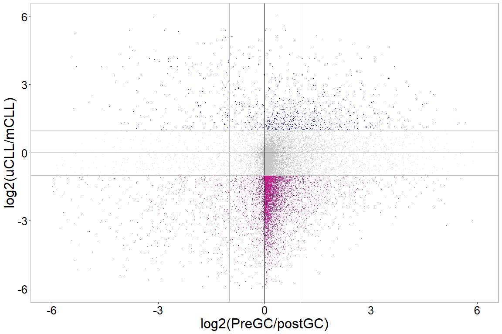<!-- -->

#### 3C


```r
x = read_tsv("../data/cpg_CLL_enh.DN.DNAMe.txt")
x = x %>% na.omit() %>% select(-contains("small")) %>% select(-contains("large")) 

colnames(x) <- gsub('.bed.combine.5mC.CpG.NA_id.methValue', '', colnames(x))

ucll = c("EGAN00001343492:CLL.12:12CLL", "EGAN00001343490:CLL.182:182CLL", "CLL_95", "CLL_30", "CLL_30.large", "CLL_30.small", "CLL_27", "CLL_29", "CLL_4")
mcll = c( "CLL.110", "CLL.1228",  "CLL.1525", "CLL.1532",  "CLL.3", "CLL_97", "CLL_93", "CLL_96", "CLL_94", "CLL_6", "CLL_28", "CLL_5", "CLL_26", "CLL_25",  "CLL_1")

uCLL = x %>% select(contains(ucll)) 
mCLL = x %>% select(contains(mcll))
df = cbind(uCLL, mCLL)

anno = data.frame(IGHV = c("uCLL", "uCLL", "uCLL", "uCLL", "uCLL", "uCLL", "mCLL",  "mCLL",  "mCLL",  "mCLL", "mCLL", "mCLL", "mCLL" , "mCLL",  "mCLL",  "mCLL",  "mCLL", "mCLL"))
annot_colors=list(IGHV=c(uCLL="#F59EB5",mCLL="#C61D8A"))

rownames(anno) = colnames(df)

pheatmap(df, show_rownames = F, 
         cutree_cols = 2, 
         show_colnames = F, 
         annotation_col = anno,
         annotation_colors = annot_colors,
         cluster_cols = T,
         cluster_rows = T,
         treeheight_row = 0,
         clustering_method = "ward.D2")
```

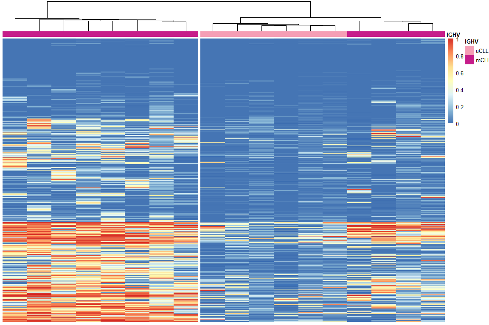<!-- -->

```r
#bcell
HMPC = x %>% select(contains("HMPC"))
PreBC = x %>% select(contains("PreBC"))
NBC = x %>% select(contains("NBC"))

GCBC = x %>% select(contains("GCBC"))
MBC = x %>% select(contains("MBC"))
PBC = x %>% select(contains("PBC"))

df2 = cbind(HMPC, PreBC, NBC, GCBC, MBC, PBC)

anno2 = data.frame(Cell = c("HMPC", "HMPC", "PreBC", "PreBC", "NBC", "NBC",  "NBC",  "NBC",  "NBC", "NBC", "GCBC", "GCBC" , "GCBC",  "GCBC",  "GCBC",  "GCBC", "GCBC" , "GCBC", "GCBC", "MBC", "MBC", "MBC", "MBC", "MBC", "PBC", "PBC", "PBC", "PBC", "PBC"))
annot_colors2=list(Cell=c(HMPC="#f0f0f0",PreBC="#bdbdbd",NBC="#636363",GCBC="#35B779FF", MBC="#26828EFF",PBC="#3E4A89FF"))
rownames(anno2) = colnames(df2)

pheatmap(df2, show_rownames = F,
         cutree_cols = 2,
         show_colnames = F, 
         annotation_col = anno2,
         annotation_colors = annot_colors2,
         cluster_cols = T,
         cluster_rows = T,
         treeheight_row = 0,
         clustering_method = "ward.D2")
```

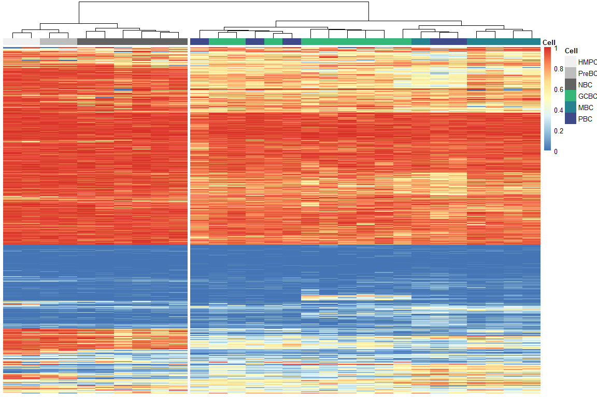<!-- -->

#### 3D


```r
# input file is too big to load on github and phs000435.v3 metadata can not be shared publicly. The data can be shared upon request.
clust <- makeCluster(4)
x = fread("../data/cpg_CLL_enh.DN.DNAMe.txt", nThread = 4)[,1]
colnames(x) = "A.ID.idval"
rrbs = read.table("../data/table_rrbs_subset.tsv", header = T) # this file is too big to load on github
colnames(rrbs) <- gsub('.dupsFlagged.q5.5mC.CpG.gz.ombine.5mC.CpG.bed.idval', '', colnames(rrbs))
colnames(rrbs) <- gsub('.1.ombine.5mC.CpG.bed.idval', '', colnames(rrbs))
colnames(rrbs) <- gsub('DFCI_', 'DFCI-', colnames(rrbs))
colnames(rrbs)

stopCluster(clust)

# get dn cpg
rrbs2 = merge(rrbs, x)
rrbs2[rrbs2 == -1] <- NA

# get cpgs with NA in <= 50% of samples
threshold <- ncol(rrbs2) / 2
df_filtered <- rrbs2[rowSums(is.na(rrbs2)) <= threshold, ]

#
pheatmap(df_filtered[,2:117], show_rownames = F,
         cutree_cols = 2,
         show_colnames = F, 
         #annotation_col = anno2,
         #annotation_colors = annot_colors2,
         cluster_cols = T,
         cluster_rows = T,
         treeheight_row = 0,
         na_col = "black",
         clustering_method = "ward.D2")
```

#### 3E


```r
x = read.table("../data/2016.02.23_qCEMT_patient_sample_info_Joseph_Connors.csv", sep = ",", head = T)

os = x %>% filter(Enh_met != "") %>% filter(!grepl("CEMT_30", StudySubCode)) 

fit <- survfit(Surv(Progression.free.survival..y., treatment_at_epi) ~ Enh_met, data = os)

#calculate p-value
surv_pvalue(
  fit,
  data = NULL,
  method = "FH_p=1_q=1",
  test.for.trend = FALSE,
  combine = FALSE
)
```

```
##   variable   pval                        method  pval.txt
## 1  Enh_met 0.0426 Fleming-Harrington (p=1, q=1) p = 0.043
```

```r
ggsurvplot(fit,
           pval = F, conf.int = F,
           risk.table = F, 
           risk.table.col = "strata", 
           ggtheme = theme_bw(), 
           palette = c("red", "blue"))
```

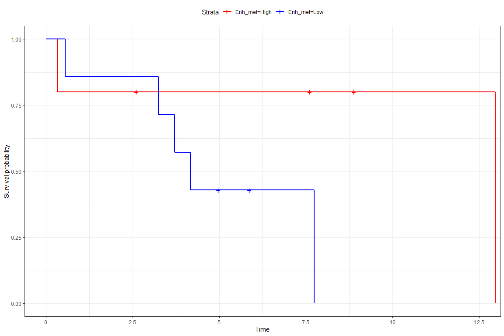<!-- -->

#### 3F


```r
x = read.table("../data/known1.motif.bed.H3K27ac_DE.bed.profileMean_all_54lib", sep = '\t', head = T)
x2 = melt(x)
x2$motif = rep("NFAT", nrow(x))
nfat = x2 %>% mutate(axis = rep(c((40:1)*-50, 0, (1:39)*50), ncol(x)))

x = read.table("../data/known2.motif.bed.H3K27ac_DE.bed.profileMean_all_54lib", sep = '\t', head = T)
x2 = melt(x)
x2$motif = rep("EGR2", nrow(x))
egr2 = x2 %>% mutate(axis = rep(c((40:1)*-50, 0, (1:39)*50), ncol(x)))

x = read.table("../data/known3.motif.bed.H3K27ac_DE.bed.profileMean_all_54lib", sep = '\t', head = T)
x2 = melt(x)
x2$motif = rep("IRF8", nrow(x))
irf8 = x2 %>% mutate(axis = rep(c((40:1)*-50, 0, (1:39)*50), ncol(x)))

x = read.table("../data/known4.motif.bed.H3K27ac_DE.bed.profileMean_all_54lib", sep = '\t', head = T)
x2 = melt(x)
x2$motif = rep("bZIP28", nrow(x))
bzip28 = x2 %>% mutate(axis = rep(c((40:1)*-50, 0, (1:39)*50), ncol(x)))

df = rbind(nfat, egr2, irf8, bzip28) 
df$variable <- gsub('.bed.combine.5mC.CpG.bedGraph.bw.profileMean', '', df$variable) 

low = c("CLL_94", "EGAN00001358480.CLL.1532.1532CLL", "CLL_5", "CLL_97", "CLL_95", "CLL_30", "CLL_27", "CLL_4", "EGAN00001343492.CLL.12.12CLL", "EGAN00001343490.CLL.182.182CLL")
high = c("CLL_96", "CLL_25", "CLL_28", "EGAN00001401801.CLL.1228.1228CLL", "EGAN00001358479.CLL.1525.1525CLL", "CLL_6", "EGAN00001343494.CLL.110.110CLL", "CLL_26")

df$Cell <- ifelse(df$variable %in% low, "Low",
                  ifelse(df$variable %in% high, "High",
                         ifelse(grepl("GCBC", df$variable, ignore.case = T), "GCBC", 
                                ifelse(grepl("csMBC", df$variable, ignore.case = T), "MBC", 
                                       ifelse(grepl("HMPC", df$variable, ignore.case = T), "HMPC",
                                              ifelse(grepl("NBC", df$variable, ignore.case = T), "NBC",
                                                     ifelse(grepl("PBC", df$variable, ignore.case = T), "PBC",
                                                            ifelse(grepl("PreBC", df$variable, ignore.case = T), "PreBC",
                                                                   ifelse(grepl("MBC", df$variable, ignore.case = T), "MBC", "other")))))))))

#remove cemt_30 large and small
df = df %>% na.omit()

df2 = df %>%
  filter(variable !="CLL_28.large") %>%
  filter(variable !="CLL_28.small") %>%
  filter(variable !="CLL_30.large") %>%
  filter(variable !="CLL_30.small") %>%
  filter(variable != "EGAN00001286337.NBC.6.NC11_83") %>%
  filter(variable != "CLL_29") %>% 
  filter(variable != "EGAN00001235812.MBC.2.csMBC")

df2$Cell = factor(df2$Cell, levels = c("HMPC","PreBC" , "NBC", "GCBC", "MBC", "PBC", "Low", "High"))
df2$motif = factor(df2$motif, levels = c("NFAT", "EGR2", "IRF8", "bZIP28"))

ggplot(df2, aes(axis, value, group = variable, color = Cell)) +
  geom_smooth(se = F) +
  scale_color_manual(values=c("#bdbdbd", "#636363", "black", "#35B779FF", "#26828EFF", "#3E4A89FF", "#3182bd", "#c51b8a" )) +
  facet_grid(~motif) +
  xlab("") +
  ylab("Methylation") +
  theme(panel.background = element_rect(fill = "white"),
        panel.border = element_rect(fill = NA, colour = "gray", size = .5),
        strip.background =element_rect(fill="white"),
        axis.text = element_text(color = "black", angle = 0, hjust = 1),
        legend.position = "bottom")
```

<!-- -->

### Figure 4.

#### 4B


```r
#plot for dn cpgs
x = fread("../data/UP_CpG_binary_intersect.txt")
names(x) = gsub(".UP.txt.1-0insert.Value","",names(x)) 

upset(x, sets = c("High-mCLL", "High-uCLL", "Low-High",  "Low-mCLL",  "Low-uCLL", "uCLL-mCLL"), 
      order.by = "freq", 
      mb.ratio = c(0.6, 0.4),
      point.size = 5, 
      line.size = 1.5,
      show.numbers = "no",
      shade.alpha = 0.5, 
      matrix.dot.alpha = .1,
      empty.intersections = NULL,
      nintersects = 25,
      text.scale = 2, 
      number.angles = 45,
      main.bar.color = "black",
      sets.bar.color = "black",
      #matrix.color = "black",
      shade.color = "gray88",
      sets.x.label = "# CpGs",
      mainbar.y.label = "Intersection of CpGs")
```

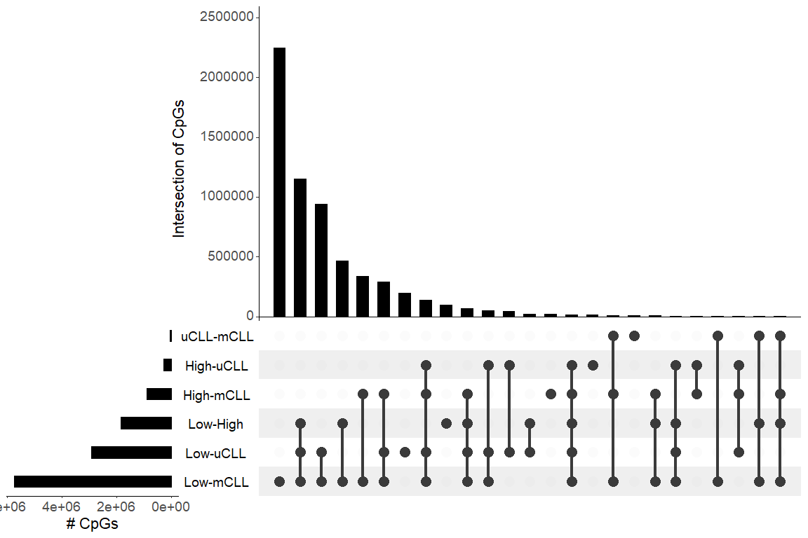<!-- -->
#### 4C


```r
x = read.table("../data/AvgMeth_at_each_DMRs_Hypo_139602_independent_Low+High_light.txt")

x2 = x %>%
  filter(V1 != "EGAN00001235812:MBC.2:csMBC.bed.combine.5mC.CpG") %>% filter(V1 != "EGAN00001286337:NBC.6:NC11_83.bed.combine.5mC.CpG") %>% filter(V1 != "CLL_29.bed.combine.5mC.CpG")

x2$V1 = gsub(".bed.combine.5mC.CpG","",x2$V1) 
x2$V2 = gsub("Hypo_139602_independent_Low+High_ID","Unique_CLL_Hypo",x2$V2) 

x3 = dcast(x2, V2 ~ V1, value.var="V3")

x4 = x3[,2:(ncol(x3))]
rownames(x4) = x3$V2
pheatmap(x4, border_color = NA, show_rownames = F, show_colnames = F, fontsize = 24)
```

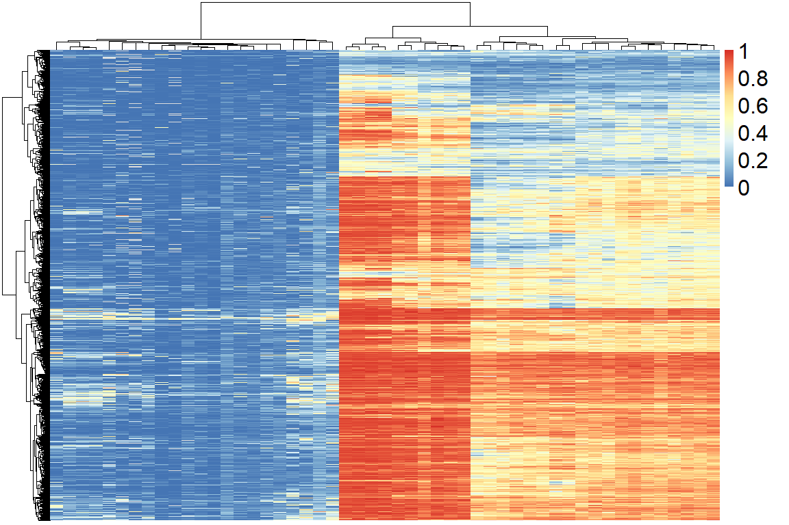<!-- -->

#### 4D


```r
df = read.table("../data/hypo_random_colmeans_77k")
df[, 2:101] <- sweep(df[, 2:101], 1, df[, 2], "/")

df <- df %>%
  separate(V1, into = c("Cell", "Type"), sep = "_")

x = df
x2 = melt(x)
x3 = data.frame(x2, x = 1:nrow(x2))

x3$Cell <- factor(x3$Cell, levels = c("NBC", "GCBC", "MBC",  "PBC", "uCLL", "mCLL"))

x3 %>%
ggplot(aes(x, value, color = Type)) +
  # geom_line() +
  geom_smooth(se = FALSE, method = "gam") +
  scale_color_manual(values = c("#C61D8A", "black")) +
  #facet_grid(~Cell) +
  facet_wrap(~ Cell, nrow = 3, ncol = 2) + 
  theme(panel.background = element_rect(fill = "white"),
        panel.border = element_rect(fill = NA, colour = "gray", size = 1),
        strip.background =element_rect(fill="white"),
        legend.position = "bottom",
        axis.text = element_text(color = "black", angle = 90, vjust = 0.5, hjust=1))
```

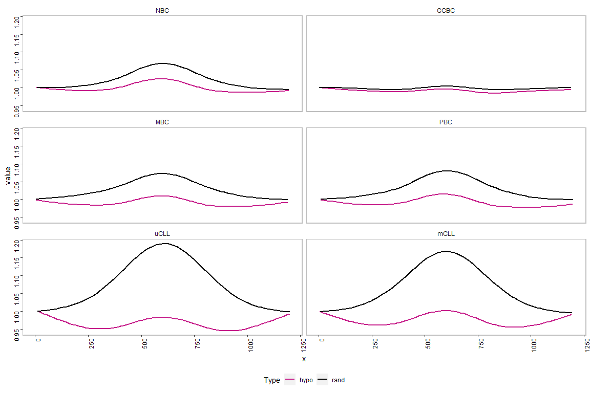<!-- -->

#### 4E


```r
x1 = read.table("../data/HypoMR.5712.bed.cpgdensity", header = F)
x2 = read.table("../data/HyperMR.192.bed.cpgdensity", header = F)

df1 = data.frame(type = rep("HypoMR", nrow(x1)), value = x1$V6)
df2 = data.frame(type = rep("HyperMR", nrow(x2)), value = x2$V6)
df = rbind(df1, df2)

df$type = factor(df$type, levels = c("HypoMR",  "HyperMR")) 

df %>% 
  ggplot(aes(type, value)) +
  geom_violin() +
  geom_boxplot(width=0.1, aes(color = type)) +
  scale_color_manual(values = c("#C61D8A", "black")) + 
  ylab("CpG per base") +
  xlab("") +
  theme(panel.background = element_rect(fill = "white"),
        panel.border = element_rect(fill = NA, colour = "gray", size = 1),
        strip.background =element_rect(fill="white"),
        legend.position = "bottom",
        axis.text = element_text(color = "black", angle = 90, vjust = 0.5, hjust=1))
```

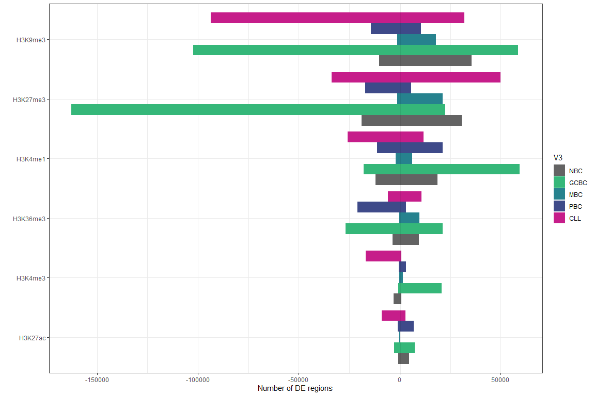<!-- -->

#### 4F


```r
# DNAme
df = read.table("../data/Avg_DNAme_CpG_denstiy_top_10.txt", header = F)
colnames(df) = c("region", "var", "value")

df$cell = ifelse(grepl("NBC", df$var, ignore.case = T), "NBC",
                 ifelse(grepl("GCBC", df$var, ignore.case = T), "GCBC",
                        ifelse(grepl("MBC", df$var, ignore.case = T), "MBC",
                               ifelse(grepl("PBC", df$var, ignore.case = T), "PBC",
                                      ifelse(grepl("CLL", df$var, ignore.case = T), "CLL",
                                             ifelse(grepl("HMPC", df$var, ignore.case = T), "HMPC",
                                                    ifelse(grepl("PreBC", df$var, ignore.case = T), "PreBC",
                                                           "other")))))))

df$type = ifelse(grepl("top", df$region, ignore.case = T), "top", 
                 ifelse(grepl("bottom", df$region, ignore.case = T), "bottom", "Other"))

df$center = ifelse(grepl("EGAN", df$var, ignore.case = T), "Blueprint", "CEMT")

df$cell = factor(df$cell, levels = c("HMPC",  "PreBC", "NBC", "GCBC", "MBC", "PBC", "CLL")) 


df %>% 
  filter(var != "EGAN00001286337:NBC.6:NC11_83.bed.combine.5mC.CpG.bed") %>%
  filter(var != "CLL_29.bed.combine.5mC.CpG.bed") %>% 
  filter(type != "Other") %>% filter(cell != "HMPC") %>% filter(cell != "PreBC") %>%
  ggplot(aes(type, value, group=var, color = type)) +
  geom_boxplot(aes(group = type)) +
  geom_point() + 
  geom_line(aes(color = "black")) +
  scale_color_manual(values = c("gray", "#C61D8A", "black")) +
  facet_grid(~cell) +
  #ylab("Average of H3K36me3 normalized read density") +
  ylab("Average DNAme") +
  xlab("") +
  theme(panel.background = element_rect(fill = "white"),
        panel.border = element_rect(fill = NA, colour = "gray", size = 1),
        strip.background =element_rect(fill="white"),
        legend.position = "bottom",
        axis.text = element_text(color = "black", angle = 0, vjust = 0.5, hjust=1))
```

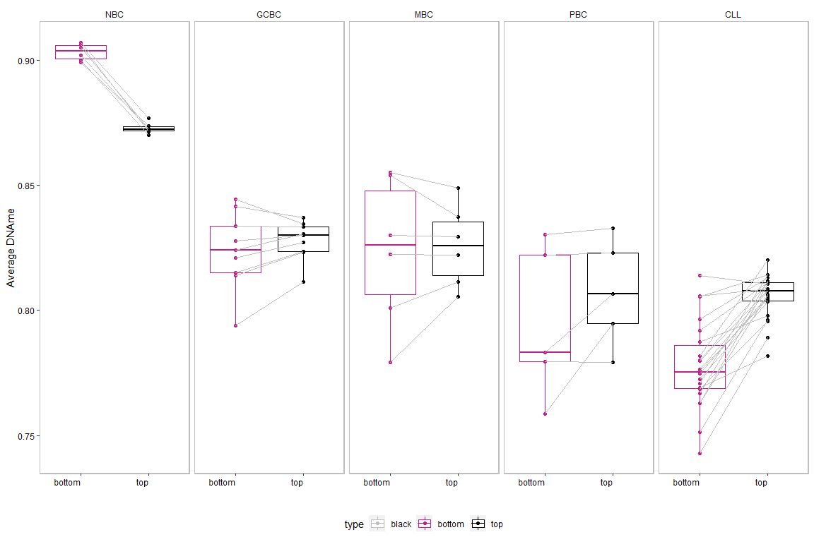<!-- -->

```r
# 36me3
df = read.table("../data/TopBottom_cpg_H3K36me3_read_count_ave.txt", header = T)

df$type = factor(df$type, levels = c("low", "high"))

df %>% 
  ggplot(aes(type, Mean, group=var, color = type)) +
  geom_boxplot(aes(group = type)) +
  geom_point() + 
  geom_line(aes(color = "black")) +
  scale_color_manual(values = c( "#C61D8A", "black", "gray")) +
  facet_grid(~cell) +
  ylab("Average of H3K36me3 normalized read density") +
  xlab("") +
  theme(panel.background = element_rect(fill = "white"),
        panel.border = element_rect(fill = NA, colour = "gray", size = 1),
        strip.background =element_rect(fill="white"),
        legend.position = "bottom",
        axis.text = element_text(color = "black", angle = 0, vjust = 0.5, hjust=1))
```

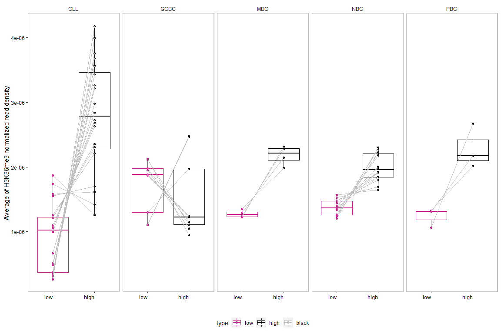<!-- -->

#### 4G


```r
gene_expression("GGA3")
```

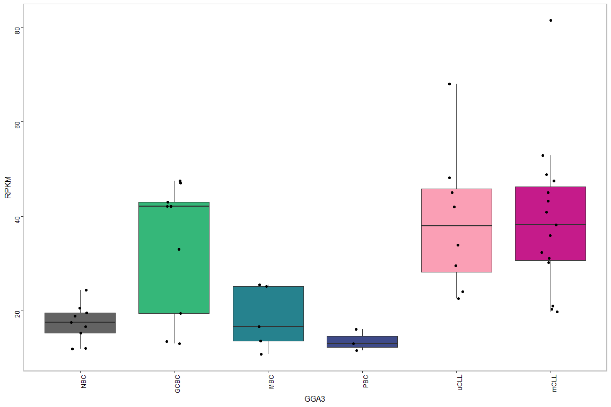<!-- -->

#### S4D


```r
## cemt all data
x = read.table("../data/cemt_H3K36me3_readcount.txt", header = F)
h = data.frame(var =x$V1, type = x$V3, value = x$V4)
l = data.frame(var =x$V1, type = x$V5, value = x$V6)
hl = rbind(h, l)

hl$type = factor(hl$type, levels = c("Low", "High"))

hl %>% 
  ggplot(aes(type, value, group=var, color = type)) +
  geom_boxplot(aes(group = type)) +
  geom_point() + 
  geom_line(aes(color = "black")) +
  scale_color_manual(values = c( "#C61D8A", "black", "gray")) +
  #facet_grid(~cell) +
  ylab("Average of H3K36me3 normalized read density") +
  xlab("") +
  theme(panel.background = element_rect(fill = "white"),
        panel.border = element_rect(fill = NA, colour = "gray", size = 1),
        strip.background =element_rect(fill="white"),
        legend.position = "bottom",
        axis.text = element_text(color = "black", angle = 0, vjust = 0.5, hjust=1)) 
```

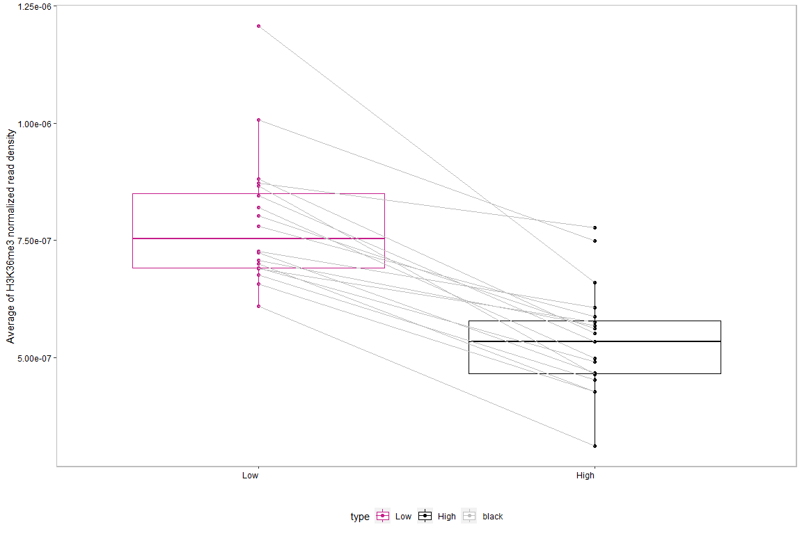<!-- -->

### Figure S2

#### S2F


```r
# cd6
me = read_tsv("../data/H3K27ac_CLL_enriched_over_others_dname.tsv")
me2 = me %>% 
  select(-starts_with("EGAN00001235812")) %>%
  select(-starts_with("EGAN00001286337")) %>%
  select(-starts_with("CLL_29")) %>%
  select(-contains("small")) %>% 
  select(-contains("large"))

bcl = read.table("../data/cd6cll_specific_h3k27ac.txt")
colnames(bcl) = "A.dname"
df = inner_join(bcl, me2)
colnames(df) <- gsub('.bed.combine.5mC.CpG.dname', '', colnames(df))

xm = melt(df, id.vars = "A.dname") %>% na.omit()

ucll = c("EGAN00001343492:CLL.12:12CLL", "EGAN00001343490:CLL.182:182CLL", "CLL_95", "CLL_30", "CLL_30.large", "CLL_30.small", "CLL_27", "CLL_29", "CLL_4")
mcll = c( "EGAN00001343494:CLL.110:110CLL", "EGAN00001358479:CLL.1525:1525CLL", "EGAN00001358480:CLL.1532:1532CLL", "EGAN00001401801:CLL.1228:1228CLL",  "CLL.3", "CLL_97", "CLL_93", "CLL_96", "CLL_94", "CLL_6", "CLL_28", "CLL_5", "CLL_26", "CLL_25",  "CLL_1")

xm$Cell <- ifelse(xm$variable %in% mcll, "mCLL", 
                  ifelse(xm$variable %in% ucll, "uCLL",
                         ifelse(grepl("MBC", xm$variable, ignore.case = T), "MBC", 
                                ifelse(grepl("HMPC", xm$variable, ignore.case = T), "HMPC",
                                       ifelse(grepl("NBC", xm$variable, ignore.case = T), "NBC",
                                              ifelse(grepl("PBC", xm$variable, ignore.case = T), "PBC",
                                                     ifelse(grepl("PreBC", xm$variable, ignore.case = T), "PreBC", # no rna-seq data
                                                            ifelse(grepl("GCBC", xm$variable, ignore.case = T), "GCBC", 
                                                                   ifelse(grepl("CLP", xm$variable, ignore.case = T), "CLP", "nothing")))))))))

xm2 = xm %>%
  filter(Cell != "HMPC") %>%
  filter(Cell != "PreBC")

xm2$Cell <- factor(xm2$Cell, levels = c("NBC", "GCBC", "MBC", "PBC", "uCLL", "mCLL"))

xm2 %>%
  ggplot(aes(Cell, value)) +
  geom_hline(yintercept = 0.5, color = "gray", linetype = "dashed") +
  geom_violin(aes(fill = Cell)) +
  geom_boxplot(width = 0.05, fill = "white", color = "black", outlier.shape = NA, lwd = .1) +
  scale_fill_manual(values=c("#636363", "#35B779FF", "#26828EFF", "#3E4A89FF", "#fa9fb5", "#c51b8a")) +
  ylab("Average DNAme") +
  xlab("") +
  theme(panel.background = element_rect(fill = "white"),
        panel.border = element_rect(fill = NA, colour = "gray", size = 1),
        strip.background =element_rect(fill="white"),
        legend.position = "none",
        axis.text = element_text(color = "black", angle = 90, vjust = 0.5, hjust=1)) +
  scale_y_continuous(name = NULL, sec.axis = sec_axis(~., name = "Average DNAme")) +
  guides(y = "none")
```

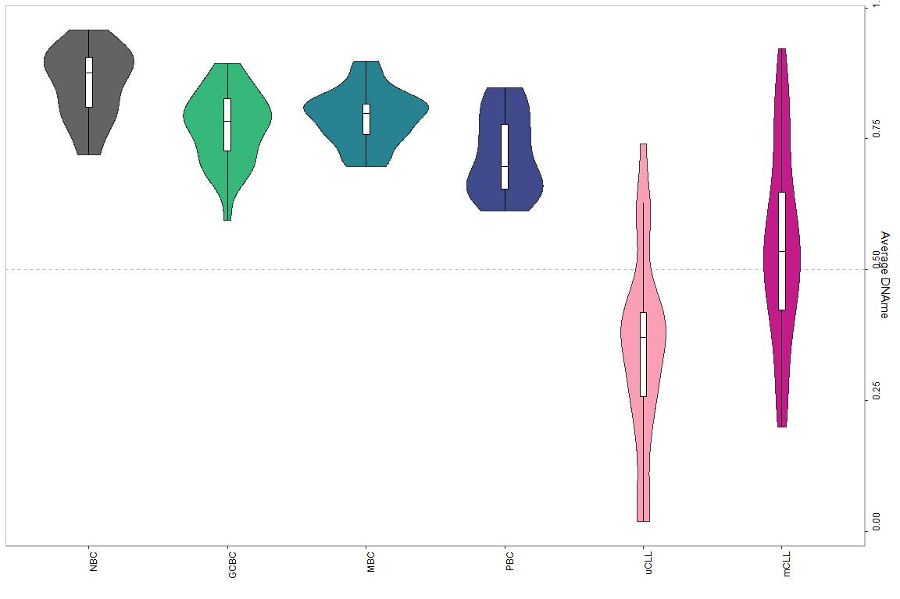<!-- -->

#### S2I


```r
#pmaip1
me = read_tsv("../data/H3K27ac_CLL_enriched_over_others_dname.tsv")
me2 = me %>% 
  select(-starts_with("EGAN00001235812")) %>%
  select(-starts_with("EGAN00001286337")) %>%
  select(-starts_with("CLL_29")) %>%
  select(-contains("small")) %>% 
  select(-contains("large"))

bcl = read.table("../data/pmaip1_cll_specific_h3k27ac.txt")
colnames(bcl) = "A.dname"
df = inner_join(bcl, me2)
colnames(df) <- gsub('.bed.combine.5mC.CpG.dname', '', colnames(df))

xm = melt(df, id.vars = "A.dname") %>% na.omit()

ucll = c("EGAN00001343492:CLL.12:12CLL", "EGAN00001343490:CLL.182:182CLL", "CLL_95", "CLL_30", "CLL_30.large", "CLL_30.small", "CLL_27", "CLL_29", "CLL_4")
mcll = c( "EGAN00001343494:CLL.110:110CLL", "EGAN00001358479:CLL.1525:1525CLL", "EGAN00001358480:CLL.1532:1532CLL", "EGAN00001401801:CLL.1228:1228CLL",  "CLL.3", "CLL_97", "CLL_93", "CLL_96", "CLL_94", "CLL_6", "CLL_28", "CLL_5", "CLL_26", "CLL_25",  "CLL_1")

xm$Cell <- ifelse(xm$variable %in% mcll, "mCLL", 
                  ifelse(xm$variable %in% ucll, "uCLL",
                         ifelse(grepl("MBC", xm$variable, ignore.case = T), "MBC", 
                                ifelse(grepl("HMPC", xm$variable, ignore.case = T), "HMPC",
                                       ifelse(grepl("NBC", xm$variable, ignore.case = T), "NBC",
                                              ifelse(grepl("PBC", xm$variable, ignore.case = T), "PBC",
                                                     ifelse(grepl("PreBC", xm$variable, ignore.case = T), "PreBC", # no rna-seq data
                                                            ifelse(grepl("GCBC", xm$variable, ignore.case = T), "GCBC", 
                                                                   ifelse(grepl("CLP", xm$variable, ignore.case = T), "CLP", "nothing")))))))))

xm2 = xm %>%
  filter(Cell != "HMPC") %>%
  filter(Cell != "PreBC")

xm2$Cell <- factor(xm2$Cell, levels = c("NBC", "GCBC", "MBC", "PBC", "uCLL", "mCLL"))

xm2 %>%
  ggplot(aes(Cell, value)) +
  geom_hline(yintercept = 0.5, color = "gray", linetype = "dashed") +
  geom_violin(aes(fill = Cell)) +
  geom_boxplot(width = 0.05, fill = "white", color = "black", outlier.shape = NA, lwd = .1) +
  scale_fill_manual(values=c("#636363", "#35B779FF", "#26828EFF", "#3E4A89FF", "#fa9fb5", "#c51b8a")) +
  ylab("Average DNAme") +
  xlab("") +
  theme(panel.background = element_rect(fill = "white"),
        panel.border = element_rect(fill = NA, colour = "gray", size = 1),
        strip.background =element_rect(fill="white"),
        legend.position = "none",
        axis.text = element_text(color = "black", angle = 90, vjust = 0.5, hjust=1)) +
  scale_y_continuous(name = NULL, sec.axis = sec_axis(~., name = "Average DNAme")) +
  guides(y = "none")
```

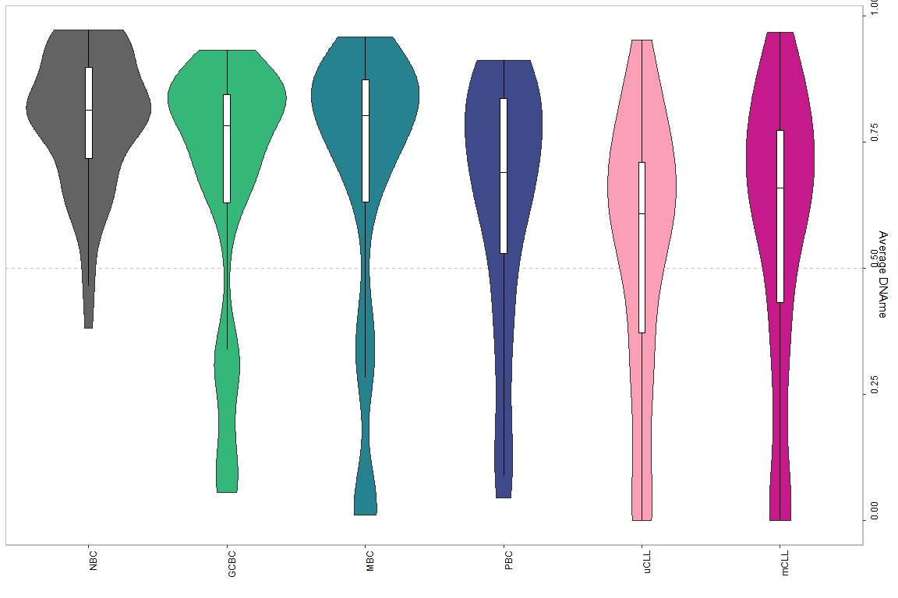<!-- -->

### Figure S3

#### S3


#### S3D


```r
x = read.table("../data/2016.02.23_qCEMT_patient_sample_info_Joseph_Connors.csv", sep = ",", head = T)

os = x %>% filter(Enh_met != "") %>% filter(!grepl("CEMT_30", StudySubCode)) 

fit <- survfit(Surv(Progression.free.survival..y., treatment_at_epi) ~ IGHV, data = os)

#calculate p-value
surv_pvalue(
  fit,
  data = NULL,
  method = "FH_p=1_q=1",
  test.for.trend = FALSE,
  combine = FALSE
)
```

```
##   variable   pval                        method pval.txt
## 1     IGHV 0.2635 Fleming-Harrington (p=1, q=1) p = 0.26
```

```r
ggsurvplot(fit,
           pval = F, conf.int = F,
           risk.table = F, 
           risk.table.col = "strata",
           ggtheme = theme_bw(), 
           palette = c("red", "blue"))
```

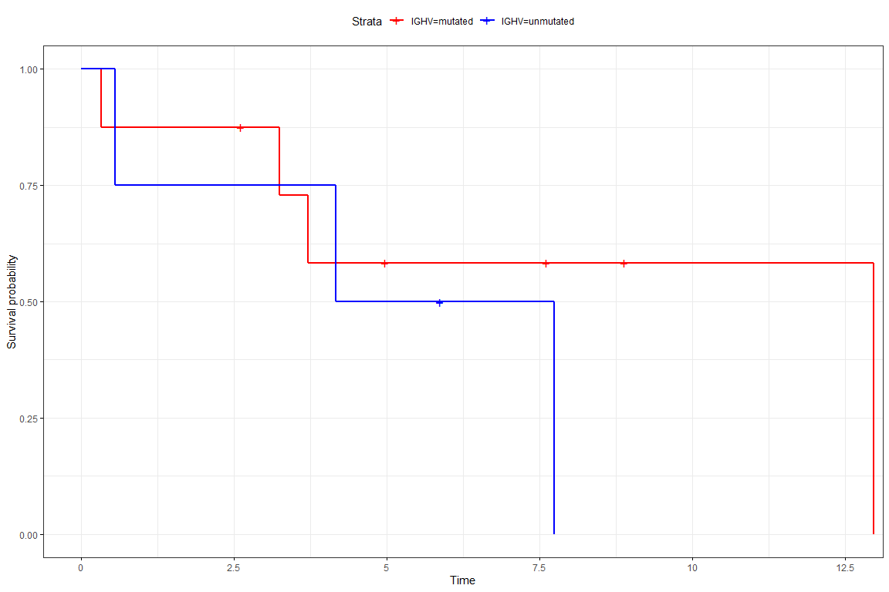<!-- -->
